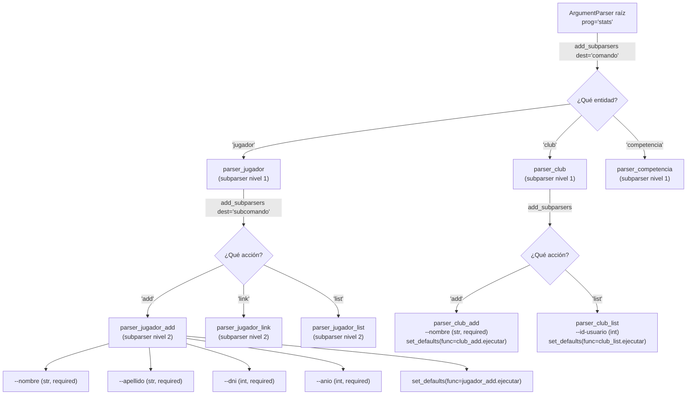
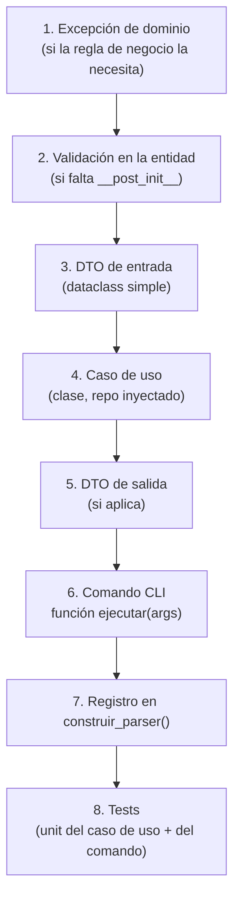
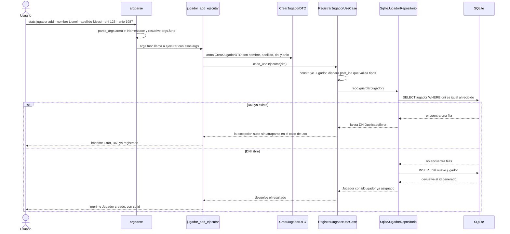

# US-103 — De `argparse` al primer comando: jerarquía, orden de archivos y flujo completo

> Continuación de [2026-08-17-us103-explicada-en-profundidad.md](2026-08-17-us103-explicada-en-profundidad.md).
> Ese documento explica el **qué** y el **por qué** de casos de uso, DTOs y comandos. Este
> documento se enfoca en el **cómo se arma en código, en qué orden, y cómo se prueba** —
> arrancando por `argparse` (la pregunta que disparó esto) y terminando en el flujo completo de
> los 9 casos de uso de la US.
>
> **Estado verificado hoy (2026-08-29):**
>
> - `src/aplicacion/DTOs/jugador_dto.py` **ya tiene contenido**: `CrearJugadorDTO` y `JugadorDTO`.
> - `src/aplicacion/casos_uso/registrar_jugador.py` **ya existe**: `RegistrarJugadorUseCase`.
> - `src/dominio/exceptions.py` **ya tiene las 5 excepciones** completas (`ErrorDeDominio`,
>   `DNIDuplicadoError`, `ClubNoEncontradoError`, `UsuarioNoEncontradoError`,
>   `CredencialesInvalidasError`, `VinculoActivoExistenteError`).
> - `src/aplicacion/DTOs/club_dto.py`, `competencia_dto.py` y `partido_dto.py` **están creados
>   pero vacíos** — son los siguientes en la lista.
> - Todavía **no existe ningún comando CLI** ni `main_cli.py`/`commands/`. Es lo que arranca este
>   documento.
> - `tests/unit/` **ya existe como carpeta vacía** — está esperando los tests de casos de uso y
>   comandos (ver la guía de testing referenciada al final).

---

## 1. `argparse` de cero — las tres piezas

Todo `argparse` se reduce a tres objetos que se usan siempre en el mismo orden:

1. **`ArgumentParser`** — el objeto raíz. Representa "un programa" (o, como van a ver en la
   sección 2, también representa "un subcomando", porque un subparser **es** un
   `ArgumentParser`).
2. **`add_argument(...)`** — declara un parámetro que ese parser en particular acepta. Se llama
   una vez por cada flag.
3. **`parse_args()`** — lee `sys.argv` (lo que el usuario tipeó) y devuelve un `Namespace`: un
   objeto con un atributo por cada argumento declarado.

```python
import argparse

parser = argparse.ArgumentParser(prog="stats")
parser.add_argument("--nombre", required=True, help="Nombre del jugador")
parser.add_argument("--dni", required=True, type=int, help="DNI del jugador")

args = parser.parse_args()
# python main.py --nombre Lionel --dni 12345678
# -> args.nombre == "Lionel"   (str)
# -> args.dni == 12345678      (int, porque type=int ya convirtió y validó)
```

### Qué significa cada parámetro de `add_argument`

| Parámetro                   | Para qué sirve                                                                                                                                                                                                                                                          |
| --------------------------- | ----------------------------------------------------------------------------------------------------------------------------------------------------------------------------------------------------------------------------------------------------------------------- |
| nombre posicional (`"dni"`) | Argumento **obligatorio por posición** (sin `--`). Se identifica por el lugar que ocupa, no por nombre. Casi no se usa en esta CLI — se prefieren flags explícitos.                                                                                                     |
| `"--flag"`                  | Argumento **opcional por nombre**. Se vuelve obligatorio solo si le agregás `required=True`.                                                                                                                                                                            |
| `type=`                     | Convierte el string crudo de la terminal al tipo que necesitás (`int`, `float`, o una función propia). Si no lo ponés, todo llega como `str`. Si la conversión falla, `argparse` corta solo, con un mensaje de error — nunca llega a tu código un `--dni abc` como int. |
| `required=True`             | Sin esto, un `--flag` es opcional de verdad y falta en el `Namespace` con lo que le hayas puesto en `default` (o `None`).                                                                                                                                               |
| `default=`                  | Valor que toma el argumento si el usuario no lo pasó.                                                                                                                                                                                                                   |
| `help=`                     | Texto que se muestra en `--help` (se genera solo, gratis).                                                                                                                                                                                                              |
| `dest=`                     | Renombra cómo se llama el atributo final en el `Namespace`, si no querés que coincida con el nombre del flag.                                                                                                                                                           |
| `choices=[...]`             | Restringe el valor a una lista fija (por ejemplo `--tipo` de una `Competencia`: `choices=["liga", "torneo"]`).                                                                                                                                                          |

---

## 2. Jerarquía parser → subparsers → argumentos

Un **subparser** es, ni más ni menos, otro `ArgumentParser` colgado del principal vía
`add_subparsers()`. Por eso la jerarquía puede tener más de un nivel: `stats` → `jugador` → `add`
— cada nivel es un parser con sus propios `add_argument`.



Leyendo el diagrama de arriba hacia abajo: cada flecha con `add_subparsers(dest=...)` es el punto
donde `argparse` te pregunta "¿y ahora qué palabra sigue?" — el valor de `dest` es el nombre del
atributo donde queda guardada esa palabra dentro del `Namespace` (`args.comando == "jugador"`,
`args.subcomando == "add"`), aunque en la práctica casi no van a leer `args.comando`/
`args.subcomando` directo: para eso está `set_defaults(func=...)`, que ya "ata" cada hoja del
árbol a la función que la maneja.

### Cómo se recorre en código (el composition root)

```python
from infraestructura.ui.cli.commands import club_add, jugador_add


def construir_parser() -> argparse.ArgumentParser:
    parser = argparse.ArgumentParser(prog="stats")
    subparsers = parser.add_subparsers(dest="comando")

    # --- rama "jugador" ---
    parser_jugador = subparsers.add_parser("jugador", help="Operaciones sobre jugadores")
    jugador_subparsers = parser_jugador.add_subparsers(dest="subcomando")

    parser_jugador_add = jugador_subparsers.add_parser("add", help="Registra un jugador nuevo")
    parser_jugador_add.add_argument("--nombre", required=True)
    parser_jugador_add.add_argument("--apellido", required=True)
    parser_jugador_add.add_argument("--dni", required=True, type=int)
    parser_jugador_add.add_argument("--anio", required=True, type=int)
    parser_jugador_add.set_defaults(func=jugador_add.ejecutar)

    # --- rama "club" ---
    parser_club = subparsers.add_parser("club", help="Operaciones sobre clubes")
    club_subparsers = parser_club.add_subparsers(dest="subcomando")

    parser_club_add = club_subparsers.add_parser("add", help="Crea un club nuevo")
    parser_club_add.add_argument("--nombre", required=True)
    parser_club_add.set_defaults(func=club_add.ejecutar)

    return parser


def main() -> None:
    parser = construir_parser()
    args = parser.parse_args()
    if hasattr(args, "func"):
        args.func(args)          # <- delega al handler correcto, sin ningún if/elif
    else:
        parser.print_help()
```

Esto es exactamente el **Command Pattern** aplicado con `argparse` (ya adelantado en
[la sección 11 del documento anterior](2026-08-17-us103-explicada-en-profundidad.md#11-qué-es-el-command-pattern-con-argparse)):
agregar `stats competencia add` el día de mañana es _sumar 4 líneas dentro de `construir_parser`_,
nunca tocar un `if` gigante.

---

## 3. Orden de archivos a crear, por caso de uso

Para **cada** una de las 9 acciones de la US, el orden de construcción es siempre el mismo (de
adentro hacia afuera — primero lo que no depende de nada, al final lo que depende de todo):



**Por qué este orden y no al revés:** si arrancás por el comando CLI, todavía no existe nada que
llamar — terminás escribiendo lógica de negocio adentro del comando "porque hay que probarlo de
alguna forma", que es justo el anti-patrón que la US-103 pide evitar (sección 10 del documento
anterior: _"el comando nunca debería tener lógica de negocio adentro"_). Construir de adentro
hacia afuera garantiza que cuando llegás al comando, ya tenés algo real y testeado para invocar.

### Checklist concreto para `jugador add` (lo que están armando ahora)

| Paso                     | Archivo                                                                  | Estado                                |
| ------------------------ | ------------------------------------------------------------------------ | ------------------------------------- |
| 1. Excepción             | `DNIDuplicadoError` en `dominio/exceptions.py`                           | ✅ Ya existe                          |
| 2. Validación de entidad | `Jugador.__post_init__` en `dominio/entidades/jugador.py`                | ✅ Ya existe                          |
| 3. DTO de entrada        | `CrearJugadorDTO` en `aplicacion/DTOs/jugador_dto.py`                    | ✅ Ya existe                          |
| 4. Caso de uso           | `RegistrarJugadorUseCase` en `aplicacion/casos_uso/registrar_jugador.py` | ✅ Ya existe                          |
| 5. DTO de salida         | `JugadorDTO` en `aplicacion/DTOs/jugador_dto.py`                         | ✅ Ya existe (ver nota)               |
| 6. Comando CLI           | `ejecutar(args, repo=None)` en `infraestructura/ui/cli/commands/jugador_add.py` (carpeta y archivo todavía no existen) | ⬜ Pendiente — lo que están por hacer |
| 7. Registro en el parser | `construir_parser()` en `main.py` (hoy `main.py` no tiene ningún parser) | ⬜ Pendiente                          |
| 8. Tests                 | `tests/unit/test_registrar_jugador_use_case.py` + test del comando       | ⬜ Pendiente                          |

> **Nota sobre el paso 5:** `RegistrarJugadorUseCase.ejecutar()` hoy devuelve un `Jugador`
> (entidad de dominio), no un `JugadorDTO` — la sección 6 de este documento explica por qué,
> conceptualmente, convendría que devolviera el DTO en vez de la entidad, y lo pueden dejar
> anotado como algo a ajustar antes de conectar el comando.

### Orden para el resto de los 9 casos de uso

La tabla de la [sección 7 del documento anterior](2026-08-17-us103-explicada-en-profundidad.md#7-qué-casos-de-uso-hay-que-crear-los-9-de-esta-us)
ya lista los 9. Acá el mismo listado, pero marcando qué le falta a cada uno según el orden de
arriba (con lo verificado hoy):

| Caso de uso                         | DTO de entrada (archivo)                             | Repo(s)                               | Falta                                                                                                                                        |
| ----------------------------------- | ---------------------------------------------------- | ------------------------------------- | -------------------------------------------------------------------------------------------------------------------------------------------- |
| `RegistrarJugadorUseCase`           | `jugador_dto.py` → `CrearJugadorDTO`                 | `JugadorRepositorio`                  | Comando + registro + tests                                                                                                                   |
| `CrearClubUseCase`                  | `club_dto.py` (vacío) → `CrearClubDTO`               | `ClubRepositorio`                     | DTO, caso de uso, comando, registro, tests                                                                                                   |
| `VincularJugadorAClubUseCase`       | `jugador_dto.py` → `VincularJugadorClubDTO` (nuevo)  | `JugadorRepositorio`                  | DTO, caso de uso, comando, registro, tests                                                                                                   |
| `CrearCompetenciaUseCase`           | `competencia_dto.py` (vacío) → `CrearCompetenciaDTO` | `CompetenciaRepositorio`              | DTO, caso de uso, comando, registro, tests                                                                                                   |
| `InscribirClubEnCompetenciaUseCase` | `competencia_dto.py` → `InscribirClubDTO` (nuevo)    | `CompetenciaRepositorio`              | **Bloqueado**: ver nota AC5 en el doc anterior (sección 12.5) — necesita un método atómico nuevo en el repo antes de escribir el caso de uso |
| `ListarClubesUsuarioUseCase`        | (parámetro simple, `idUsuario: int`)                 | `ClubRepositorio`                     | Caso de uso, comando, registro, tests                                                                                                        |
| `ListarJugadoresClubUseCase`        | (parámetro simple, `idClub: int`)                    | `JugadorRepositorio`                  | Caso de uso, comando, registro, tests                                                                                                        |
| `ListarPartidosPorClubUseCase`      | (parámetro simple, `idClub: int`)                    | `PartidoRepositorio`                  | DTO de salida (`partido_dto.py` vacío), caso de uso, comando, registro, tests                                                                |
| `CambiarClubActivoUseCase`          | —                                                    | (depende de `SessionManager`, US-104) | Puede quedar de último — bloqueado por una US futura                                                                                         |

**Por qué algunos casos de uso "de listar" no necesitan DTO de entrada propio:** cuando el caso de
uso solo necesita **un dato suelto** (un `id`) para hacer su trabajo, armar una dataclass de un
solo campo (`ListarJugadoresClubDTO(idClub: int)`) es sobre-ingeniería — alcanza con que
`ejecutar(self, id_club: int)` reciba el `int` directo. La regla práctica: **DTO cuando son varios
campos relacionados que viajan juntos** (`CrearJugadorDTO` tiene 4 campos que siempre van juntos);
**parámetro suelto cuando es un solo dato**. Esto no es una regla de la US, es una convención de
buen gusto — si el equipo prefiere ser 100% consistente y usar DTO siempre, también es válido,
pero no es obligatorio.

---

## 4. Dónde vive cada cosa en el árbol real del proyecto

El documento del 17/08 (secciones 10-11) hablaba de un `main_cli.py` como "composition root"
separado de `main.py`. En este proyecto real **no hace falta ese archivo nuevo**: `src/main.py`
ya cumple ese rol — es el punto de entrada, y la guía de arquitectura
([arquitectura.md, sección 12](../guias/arquitectura.md#12-ciclo-de-vida-en-mainpy-orquestación))
ya lo describe como el lugar donde se arma todo. Conclusión práctica: `construir_parser()` y
`main()` van los dos en `src/main.py`, tal cual está hoy — no se crea un `main_cli.py` aparte.

Lo que sí es nuevo — hoy no existe ninguna carpeta `infraestructura/ui/` — es la carpeta de
comandos, tal como la especifica la sección 10 del documento del 17/08:
`src/infraestructura/ui/cli/commands/`, un archivo por combinación entidad+acción. Cada uno
expone una función llamada `ejecutar` (así la nombra el propio ejemplo de esa sección — se usa
acá el mismo nombre en vez de `comando_jugador_add`, porque el nombre del **archivo**
`jugador_add.py` ya dice de qué comando se trata; la función adentro no necesita repetirlo).

Árbol completo, con lo que ya existe marcado y lo nuevo resaltado:

```text
src/
├── main.py                                  # YA EXISTE — acá van construir_parser() y main()
├── config/
│   └── rutas.py                             # YA EXISTE
├── dominio/
│   ├── entidades/                           # YA EXISTE (Jugador, Club, Competencia, Partido...)
│   ├── repositorios/                        # YA EXISTE (las 5 interfaces ABC)
│   └── exceptions.py                        # YA EXISTE (las 5 excepciones completas)
├── aplicacion/
│   ├── DTOs/
│   │   ├── jugador_dto.py                   # YA EXISTE, con contenido
│   │   ├── club_dto.py                      # YA EXISTE, vacío -> ver sección 6
│   │   ├── competencia_dto.py               # YA EXISTE, vacío -> ver sección 6
│   │   └── partido_dto.py                   # YA EXISTE, vacío -> ver sección 6
│   └── casos_uso/
│       ├── registrar_jugador.py             # YA EXISTE
│       ├── crear_club.py                    # NUEVO — pendiente
│       ├── vincular_jugador_a_club.py       # NUEVO — pendiente
│       └── ...                              # uno por cada caso de uso de la sección 3
└── infraestructura/
    ├── logger.py                            # YA EXISTE
    ├── persistencia/                        # YA EXISTE
    ├── repositorios/                        # YA EXISTE (los 5 Sqlite*Repositorio)
    └── ui/                                  # NUEVO — no existe ninguna carpeta ui/ todavía
        └── cli/
            └── commands/
                ├── jugador_add.py           # NUEVO — expone ejecutar(args, repo=None)
                ├── club_add.py              # NUEVO
                ├── jugador_link.py          # NUEVO
                ├── club_list.py             # NUEVO
                ├── jugador_list.py          # NUEVO
                └── game_list.py             # NUEVO (partidos)
```

Cómo quedaría `main.py` con el primer comando ya registrado — **propuesta para revisar, no está
aplicada en el repo todavía**:

```python
import argparse

import config.rutas as r
from infraestructura.logger import get_logger
from infraestructura.persistencia.database_manager import SQLiteManager
from infraestructura.ui.cli.commands import jugador_add

logger = get_logger(__name__)


def construir_parser() -> argparse.ArgumentParser:
    """Arma el árbol completo de comandos de la CLI (Command Pattern con subparsers)."""
    parser = argparse.ArgumentParser(prog="stats")
    subparsers = parser.add_subparsers(dest="comando")

    parser_jugador = subparsers.add_parser("jugador", help="Operaciones sobre jugadores")
    jugador_subparsers = parser_jugador.add_subparsers(dest="subcomando")

    parser_jugador_add = jugador_subparsers.add_parser("add", help="Registra un jugador nuevo")
    parser_jugador_add.add_argument("--nombre", required=True)
    parser_jugador_add.add_argument("--apellido", required=True)
    parser_jugador_add.add_argument("--dni", required=True, type=int)
    parser_jugador_add.add_argument("--anio", required=True, type=int)
    parser_jugador_add.set_defaults(func=jugador_add.ejecutar)

    # A medida que se sumen club_add.py, jugador_link.py, etc., se registran acá mismo,
    # con este mismo bloque de 4-5 líneas — nunca se toca lo que ya está registrado arriba.

    return parser


def inicializar_base_datos() -> None:
    """Crea el esquema y las vistas si todavía no existen. Se llama una vez al arrancar."""
    db = SQLiteManager(r.DB_FILE, r.SCHEMA_SQL, r.VISTA_SQL)
    db.connect()
    db.inicializar_schema()
    db.close_connection()


def main() -> None:
    logger.info("Ejecutando CLI")
    inicializar_base_datos()

    parser = construir_parser()
    args = parser.parse_args()
    if hasattr(args, "func"):
        args.func(args)
    else:
        parser.print_help()
    logger.info("Fin de programa")


if __name__ == "__main__":
    main()
```

**Qué cambia respecto al `main()` de hoy, y por qué** (son diferencias a propósito, no un
descuido):

- Se saca `cargar_seed()` del arranque normal. Si `inicializar_base_datos()` llamara a
  `cargar_seed()` en **cada** ejecución de la CLI, intentaría insertar de nuevo las mismas filas
  semilla cada vez que se corriera cualquier comando — y ya sea por la validación de Python o por
  la constraint `UNIQUE` de `schema.sql`, esa segunda inserción fallaría. El seed tiene sentido
  para tests y para armar una base de ejemplo una vez, no para cada arranque real de la CLI.
- Se saca `limpieza()` (ya estaba comentado en el código actual, no se estaba usando).
- `inicializar_schema()` sí se mantiene en cada arranque porque es **idempotente**
  (`CREATE TABLE IF NOT EXISTS` no rompe nada si ya corrió antes) y garantiza que el esquema
  exista antes de que cualquier comando lo necesite.
- La variable `conexion_test` y el `del` explícito desaparecen — no aportaban nada al flujo (la
  conexión se cierra igual con `close_connection()`).

Esto es una propuesta para que la evalúen — si prefieren mantener el `main()` actual tal cual
está y sumar el dispatch de `argparse` en otro lado, es una decisión válida también; lo importante
es que `construir_parser()` y el `if hasattr(args, "func")` vivan en un solo lugar conocido
(el composition root), no repetidos en cada comando.

---

## 5. La función `ejecutar` de un comando — de dónde salen sus dependencias

Esta es la pregunta concreta: **¿dónde se arma el repositorio real que necesita el caso de uso, y
por qué no se arma en `main.py`?** `infraestructura/ui/cli/commands/jugador_add.py` completo:

```python
import argparse

import config.rutas as r
from aplicacion.DTOs.jugador_dto import CrearJugadorDTO
from aplicacion.casos_uso.registrar_jugador import RegistrarJugadorUseCase
from dominio.exceptions import DNIDuplicadoError
from dominio.repositorios.jugador_repositorio import JugadorRepositorio
from infraestructura.persistencia.database_manager import SQLiteManager
from infraestructura.repositorios.sqlite_jugador_repositorio import SqliteJugadorRepositorio


def ejecutar(args: argparse.Namespace, repo: JugadorRepositorio | None = None) -> None:
    """Traduce args de CLI -> CrearJugadorDTO -> RegistrarJugadorUseCase -> mensaje al usuario.

    `repo` es opcional a propósito: en producción nunca se pasa (se arma acá mismo, contra
    SQLite real); en los tests se inyecta un repositorio falso (ver docs/guias/testing.md,
    sección 5) para no depender de una base de datos real.
    """
    if repo is None:
        conexion = SQLiteManager(r.DB_FILE, r.SCHEMA_SQL, r.VISTA_SQL).connect()
        repo = SqliteJugadorRepositorio(conexion)

    dto = CrearJugadorDTO(
        nombre=args.nombre,
        apellido=args.apellido,
        dni=args.dni,
        anioNacimiento=args.anio,
    )
    caso_uso = RegistrarJugadorUseCase(repo)

    try:
        jugador = caso_uso.ejecutar(dto)
        print(f"Jugador creado: {jugador.nombre} {jugador.apellido} (id={jugador.idJugador})")
    except DNIDuplicadoError as e:
        print(f"Error: {e}")
```

### Las tres responsabilidades de `ejecutar`, en orden

1. **Traducir** — args de `argparse` (ya tipados: `args.dni` es `int` porque el flag se declaró
   con `type=int`) a un DTO de aplicación (`CrearJugadorDTO`). Ninguna regla de negocio acá.
2. **Armar las dependencias, si no vinieron dadas** — el `if repo is None:` es la parte que
   responde la pregunta. `jugador_add.py` es, en la práctica, un **mini composition root local a
   ese comando**: el lugar donde se decide "para esta ejecución real, el repositorio es
   `SqliteJugadorRepositorio` sobre una conexión SQLite de verdad".
3. **Ejecutar y traducir la respuesta** — llama al caso de uso, y convierte el resultado (o la
   excepción de dominio) en algo que el usuario de la terminal entienda, sin traceback (AC3).

### Por qué el "armado de dependencias" vive en el comando y no en `main.py`

Podría pensarse que `main.py`, siendo el composition root "grande", debería armar **todos** los
repositorios una sola vez al arrancar y pasárselos a cada comando. La razón práctica por la que
acá conviene lo contrario (cada comando arma lo suyo, bajo demanda) es esta: **cada invocación de
la CLI (`python main.py jugador add ...`) es un proceso nuevo que ejecuta un único comando** — no
hay una sesión larga donde se reutilicen conexiones entre comandos distintos. Armar los 6
repositorios en `main.py` "por las dudas" en cada arranque sería trabajo desperdiciado: 5 de esos
6 repos no se van a usar en esa ejecución puntual. Dejar que cada comando arme solo lo que
necesita es, acá, tanto más simple de escribir como más barato en tiempo de ejecución.

Este mismo patrón (parámetro opcional que, si no se lo pasan, arma la dependencia real) es lo que
hace testeable a `ejecutar` sin tocar SQLite — el tipo del parámetro es la **interfaz**
(`JugadorRepositorio`), no la clase concreta (`SqliteJugadorRepositorio`): es la misma Inyección
de Dependencias del AC2 (documento del 17/08, sección 12.2), aplicada un nivel más arriba del caso
de uso. La sección 5 de
[docs/guias/testing.md](../guias/testing.md#5-testeando-comandos-cli-jugador_addejecutar-etc)
tiene el ejemplo completo de cómo se aprovecha esto en un test.

---

## 6. DTOs que faltan crear — atributos propuestos

Los archivos ya existen vacíos (`club_dto.py`, `competencia_dto.py`, `partido_dto.py`). Acá una
propuesta de contenido, siguiendo el mismo estilo que ya usaron en `jugador_dto.py` (dataclass
simple, sin `__post_init__`, nombres de campo iguales a los de la entidad para no generar
fricción al mapear):

```python
# club_dto.py
@dataclass
class CrearClubDTO:              # entra a CrearClubUseCase.ejecutar()
    nombre: str

@dataclass
class ClubDTO:                    # sale de CrearClubUseCase / ListarClubesUsuarioUseCase
    idClub: int
    nombre: str

@dataclass
class VincularJugadorClubDTO:     # entra a VincularJugadorAClubUseCase.ejecutar()
    idJugador: int
    idClub: int
    fechaDesde: str
```

```python
# competencia_dto.py
@dataclass
class CrearCompetenciaDTO:        # entra a CrearCompetenciaUseCase.ejecutar()
    nombre: str
    anio: int
    tipo: str | None = None

@dataclass
class CompetenciaDTO:              # sale de CrearCompetenciaUseCase
    idCompetencia: int
    nombre: str
    anio: int
    tipo: str | None

@dataclass
class InscribirClubDTO:            # entra a InscribirClubEnCompetenciaUseCase.ejecutar()
    idClub: int
    idCategoria: int
    idCompetencia: int
    fechaPresentacion: str

@dataclass
class InscripcionDTO:              # sale de InscribirClubEnCompetenciaUseCase
    idInscripcion: int
    idClub: int
    idCategoria: int
    idCompetencia: int
    idListaBuenaFe: int            # confirma que la lista se creó junto con la inscripción (AC5)
```

```python
# partido_dto.py
@dataclass
class PartidoDTO:                  # sale de ListarPartidosPorClubUseCase
    idPartido: int
    fecha: str
    estadio: str | None
    idCompetencia: int
    idClubLocal: int
    idClubVisitante: int
```

---

## 7. El flujo completo: comando → DTO → caso de uso → repo → DB (y de vuelta)

Este es el diagrama que responde "¿qué hace el caso de uso por dentro?", usando `jugador add`
como ejemplo end-to-end (es el más avanzado hoy, y el patrón se repite igual para los otros 8).



(Los nombres de los participantes son identificadores simples a propósito — un diagrama de
secuencia de Mermaid puede fallar al renderizar si el alias de un participante lleva paréntesis o
comillas sin escapar; por eso `jugador_add_ejecutar` en vez de `jugador_add.ejecutar(args)`, por
ejemplo. El nombre real del módulo/función se aclara en el texto de abajo, no en el diagrama.)

**La "secuencia lógica" del caso de uso, en palabras**, siguiendo el AC3 (fail-fast) del documento
anterior:

1. Recibe el DTO de entrada (datos ya tipados, nada de parsear strings acá — eso ya lo hizo
   `argparse` con `type=int`).
2. Construye la entidad de dominio (`Jugador(...)`) — esto dispara automáticamente el
   `__post_init__` de la entidad, que corta con `TypeError` si algún campo tiene el tipo
   equivocado (una primera capa de validación, gratis, con el mismo objeto).
3. Delega al repositorio (`repo.guardar(jugador)`) — el repo es quien sabe si el DNI está
   duplicado (consulta la base) y decide lanzar `DNIDuplicadoError` **antes** de insertar.
4. Si todo salió bien, devuelve el resultado (hoy la entidad `Jugador`; la sección 9 del
   documento anterior explica por qué a futuro conviene que sea un DTO de salida en vez de la
   entidad cruda).
5. La excepción de dominio, si la hay, **no se atrapa en el caso de uso** — sube tal cual hasta
   el comando CLI, que es el único lugar que decide cómo mostrarla al usuario (separación de
   responsabilidades: el caso de uso decide _qué_ está mal, el comando decide _cómo_ se lo cuenta
   al usuario).

### Tabla resumen: qué ejecuta qué (los 9 casos de uso)

| Comando CLI (futuro)          | Archivo / función handler         | DTO de entrada           | Caso de uso                         | DTO/dato de salida                     |
| ----------------------------- | ---------------------------------- | ------------------------ | ----------------------------------- | -------------------------------------- |
| `stats jugador add`           | `jugador_add.ejecutar`             | `CrearJugadorDTO`        | `RegistrarJugadorUseCase`           | `Jugador` (hoy) / `JugadorDTO` (ideal) |
| `stats club add`              | `club_add.ejecutar`                | `CrearClubDTO`           | `CrearClubUseCase`                  | `ClubDTO`                              |
| `stats jugador link`          | `jugador_link.ejecutar`            | `VincularJugadorClubDTO` | `VincularJugadorAClubUseCase`       | `JugadorClub`                          |
| `stats competencia add`       | `competencia_add.ejecutar`         | `CrearCompetenciaDTO`    | `CrearCompetenciaUseCase`           | `CompetenciaDTO`                       |
| `stats competencia inscribir` | `competencia_inscribir.ejecutar`   | `InscribirClubDTO`       | `InscribirClubEnCompetenciaUseCase` | `InscripcionDTO`                       |
| `stats club list`             | `club_list.ejecutar`               | `idUsuario: int`         | `ListarClubesUsuarioUseCase`        | `list[ClubDTO]`                        |
| `stats jugador list`          | `jugador_list.ejecutar`            | `idClub: int`            | `ListarJugadoresClubUseCase`        | `list[JugadorDTO]`                     |
| `stats partido list`          | `game_list.ejecutar`               | `idClub: int`            | `ListarPartidosPorClubUseCase`      | `list[PartidoDTO]`                     |
| `stats club activo`           | `club_activo.ejecutar`             | _(stub, US-104)_         | `CambiarClubActivoUseCase`          | _(stub, US-104)_                       |

Cada fila de la columna "Archivo / función handler" es, ni más ni menos, un archivo nuevo en
`infraestructura/ui/cli/commands/` (sección 4) con la misma forma que `jugador_add.py` (sección
5): traduce args → DTO, arma sus dependencias si no se las pasaron, ejecuta el caso de uso, y
traduce el resultado o la excepción a algo legible en la terminal.

---

## 8. Cómo se testea todo esto

Esta sección es un resumen corto — la explicación completa de conceptos, técnicas y ejemplos de
código está en la guía dedicada: **[docs/guias/testing.md](../guias/testing.md)**. Léanla antes de
escribir el primer test de un caso de uso, ahorra bastante prueba y error.

Lo puntual para la US-103:

- **Los 9 casos de uso** se testean en `tests/unit/` (ya existe la carpeta, vacía) con un
  **repositorio falso** (no SQLite real) — así el test corre en microsegundos y no depende de la
  base. Cada caso de uso necesita mínimo dos tests: el camino feliz, y el camino que dispara la
  excepción de dominio correspondiente (`DNIDuplicadoError`, `VinculoActivoExistenteError`, etc.).
- **Los repositorios** (`SqliteJugadorRepositorio`, etc.) siguen testeándose en
  `tests/integration/` como ya lo vienen haciendo — ahí sí importa que sea SQLite real (en
  memoria, vía la fixture `db_conexion` de `conftest.py`), porque lo que se está probando es que
  el SQL funciona.
- **Los comandos CLI** (`jugador_add.ejecutar`, etc.) son la parte nueva a nivel de técnica: se
  testean llamando la función directo con un `argparse.Namespace` armado a mano (sin pasar por
  `sys.argv` ni por la terminal real), y capturando lo que imprimen con el fixture `capsys` de
  `pytest`. La guía de testing tiene el ejemplo completo.
