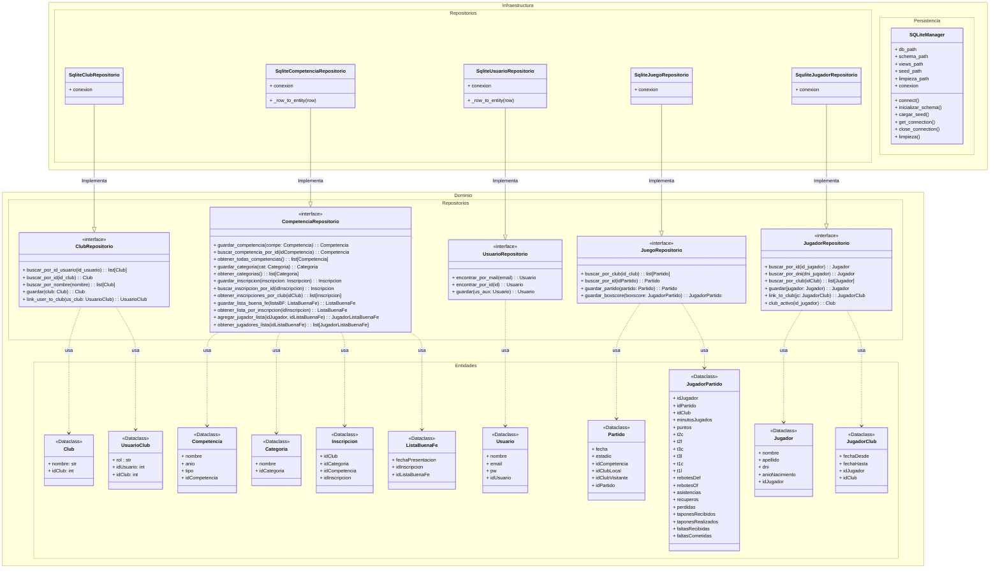
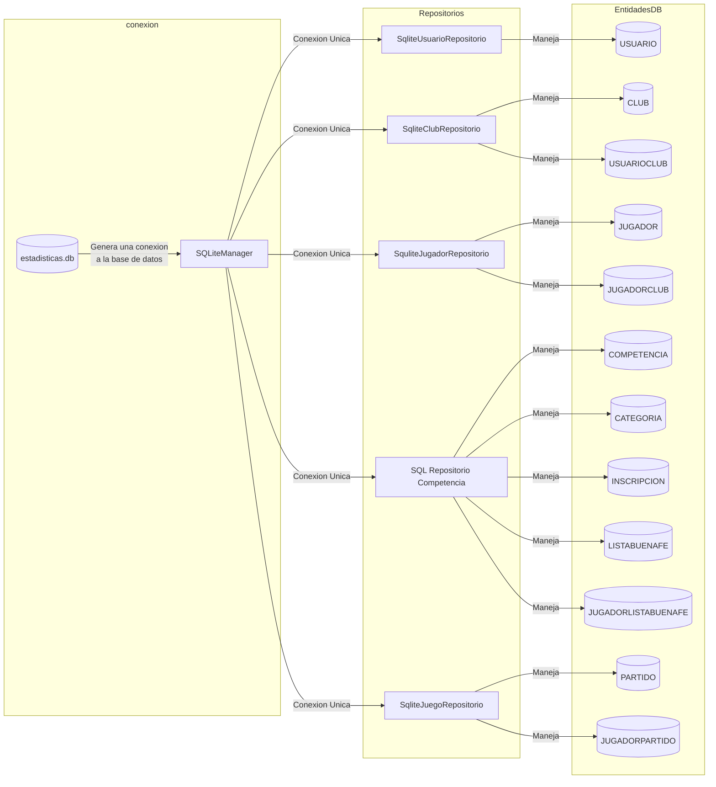
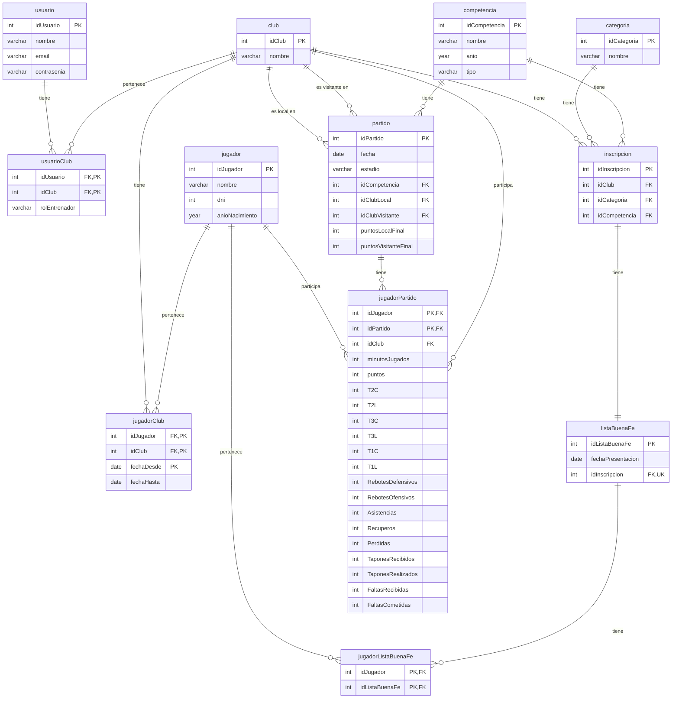

# Diagrama Utiles

## Diagrama de clases

```mermaid
classDiagram
    SqliteClubRepositorio --|> ClubRepositorio : Implementa
    SqliteJuegoRepositorio --|> JuegoRepositorio : Implementa
    SquliteJugadorRepositorio --|> JugadorRepositorio : Implementa
    SqliteUsuarioRepositorio --|> UsuarioRepositorio : Implementa
    SqliteCompetenciaRepositorio --|> CompetenciaRepositorio : Implementa
    ClubRepositorio ..> Club : usa
    ClubRepositorio ..> UsuarioClub : usa
    CompetenciaRepositorio ..> Competencia : usa
    CompetenciaRepositorio ..> Categoria : usa
    CompetenciaRepositorio ..> Inscripcion : usa
    CompetenciaRepositorio ..> ListaBuenaFe : usa
    UsuarioRepositorio ..> Usuario : usa
    JuegoRepositorio ..> Partido : usa
    JuegoRepositorio ..> JugadorPartido : usa
    JugadorRepositorio ..> Jugador : usa
    JugadorRepositorio ..> JugadorClub : usa

namespace Dominio.Repositorios{
    class ClubRepositorio{
        <<interface>>
        + buscar_por_id_usuario(id_usuario) : list[Club]
        + buscar_por_id(id_club): Club
        + buscar_por_nombre(nombre): list[Club]
        + guardar(club: Club): Club
        + link_user_to_club(us_club: UsuarioClub): UsuarioClub
    }
    class CompetenciaRepositorio{
        <<interface>>
        + guardar_competencia(compe: Competencia): Competencia
        + buscar_competencia_por_id(idCompetencia): Competencia
        + obtener_todas_competencias(): list[Competencia]
        + guardar_categoria(cat: Categoria): Categoria
        + obtener_categorias(): list[Categoria]
        + guardar_inscripcion(inscripcion: Inscripcion): Inscripcion
        + buscar_inscripcion_por_id(idInscripcion): Inscripcion
        + obtener_inscripciones_por_club(idClub): list[Inscripcion]
        + guardar_lista_buena_fe(listaBF: ListaBuenaFe): ListaBuenaFe
        + obtener_lista_por_inscripcion(idInscripcion): ListaBuenaFe
        + agregar_jugador_lista(idJugador, idListaBuenaFe): JugadorListaBuenaFe
        + obtener_jugadores_lista(idListaBuenaFe): list[JugadorListaBuenaFe]
    }
    class UsuarioRepositorio{
        <<interface>>
        + encontrar_por_mail(email): Usuario
        + encontrar_por_id(id): Usuario
        + guardar(us_aux: Usuario): Usuario
    }
    class JuegoRepositorio{
        <<interface>>
        + buscar_por_club(id_club): list[Partido]
        + buscar_por_id(idPartido): Partido
        + guardar_partido(partido: Partido): Partido
        + guardar_boxscore(boxscore: JugadorPartido): JugadorPartido
    }
    class JugadorRepositorio{
        <<interface>>
        + buscar_por_id(id_jugador): Jugador
        + buscar_por_dni(dni_jugador): Jugador
        + buscar_por_club(idClub): list[Jugador]
        + guardar(jugador: Jugador): Jugador
        + link_to_club(jc: JugadorClub): JugadorClub
        + club_activo(id_jugador): Club
    }
}
namespace Dominio.Entidades{
    class Club{
        <<Dataclass>>
        + nombre: str
        + idClub: int
    }
    class UsuarioClub{
        <<Dataclass>>
        + rol : str
        + idUsuario: int
        + idClub: int
    }
    class Competencia{
        <<Dataclass>>
        + nombre
        + anio
        + tipo
        + idCompetencia
    }
    class Categoria{
        <<Dataclass>>
        + nombre
        + idCategoria
    }
    class Inscripcion{
        <<Dataclass>>
        + idClub
        + idCategoria
        + idCompetencia
        + idInscripcion
    }
    class ListaBuenaFe{
        <<Dataclass>>
        + fechaPresentacion
        + idInscripcion
        + idListaBuenaFe
    }
    class Usuario{
        <<Dataclass>>
        + nombre
        + email
        + pw
        + idUsuario
    }
    class JugadorPartido{
        <<Dataclass>>
        + idJugador
        + idPartido
        + idClub
        + minutosJugados
        + puntos
        + t2c
        + t2l
        + t3c
        + t3l
        + t1c
        + t1l
        + rebotesDef
        + rebotesOf
        + asistencias
        + recuperos
        + perdidas
        + taponesRecibidos
        + taponesRealizados
        + faltasRecibidas
        + faltasCometidas
    }
    class Partido{
        <<Dataclass>>
        + fecha
        + estadio
        + idCompetencia
        + idClubLocal
        + idClubVisitante
        + idPartido
    }
    class Jugador{
        <<Dataclass>>
        + nombre
        + apellido
        + dni
        + anioNacimiento
        + idJugador
    }
    class JugadorClub{
        <<Dataclass>>
        + fechaDesde
        + fechaHasta
        + idJugador
        + idClub
    }
}
namespace Infraestructura.Repositorios{
    class SqliteClubRepositorio{
        + conexion
    }
    class SqliteJuegoRepositorio{
        + conexion
    }
    class SquliteJugadorRepositorio{
        + conexion
    }
    class SqliteUsuarioRepositorio{
        + conexion
        + _row_to_entity(row)
    }
    class SqliteCompetenciaRepositorio{
        + conexion
        + _row_to_entity(row)
    }
}
namespace Infraestructura.Persistencia{
    class SQLiteManager{
        + db_path
        + schema_path
        + views_path
        + seed_path
        + limpieza_path
        + conexion
        + connect()
        + inicializar_schema()
        + cargar_seed()
        + get_connection()
        + close_connection()
        + limpieza()
    }
}
```

## Diagrama Patron repositorio

```mermaid
flowchart LR
    db[(estadisticas.db)]
    dbManager["SQLiteManager"]
    repoUsuario["SqliteUsuarioRepositorio"]
    repoJugador["SquliteJugadorRepositorio"]
    repoJuego["SqliteJuegoRepositorio"]
    repoClub["SqliteClubRepositorio"]
    repoCompetencias["SQL Repositorio Competencia"]
    U[(USUARIO)]
    C[(CLUB)]
    UC[(USUARIOCLUB)]
    J[(JUGADOR)]
    JC[(JUGADORCLUB)]
    COM[(COMPETENCIA)]
    CAT[(CATEGORIA)]
    I[(INSCRIPCION)]
    LBF[(LISTABUENAFE)]
    JLBF[(JUGADORLISTABUENAFE)]
    P[(PARTIDO)]
    JP[(JUGADORPARTIDO)]

    subgraph conexion
    db-->|"Genera una conexion <br> a la base de datos"|dbManager
    end

    subgraph Repositorios
    dbManager -->|"Conexion Unica"| repoUsuario
    dbManager -->|"Conexion Unica"| repoJugador
    dbManager -->|"Conexion Unica"| repoJuego
    dbManager -->|"Conexion Unica"| repoClub
    dbManager -->|"Conexion Unica"| repoCompetencias
    end

    subgraph EntidadesDB
    repoUsuario -->|"Maneja"|U
    repoClub -->|"Maneja"|C
    repoClub -->|"Maneja"|UC
    repoCompetencias -->|"Maneja"|COM
    repoCompetencias -->|"Maneja"|CAT
    repoCompetencias -->|"Maneja"|I
    repoCompetencias -->|"Maneja"|LBF
    repoCompetencias -->|"Maneja"|JLBF
    repoJuego -->|"Maneja"|P
    repoJuego -->|"Maneja"|JP
    repoJugador -->|"Maneja"|J
    repoJugador -->|"Maneja"|JC
    end
```

## DER

```mermaid
erDiagram
    u[usuario] {
        int idUsuario PK
        varchar nombre
        varchar email
        varchar contrasenia
    }
    us[usuarioClub] {
        int idUsuario FK,PK
        int idClub FK,PK
        varchar rolEntrenador
    }
    c[club] {
        int idClub PK
        varchar nombre
    }
    jc[jugadorClub] {
        int idJugador FK,PK
        int idClub FK,PK
        date fechaDesde PK
        date fechaHasta
    }
    j[jugador] {
        int idJugador PK
        varchar nombre
        int dni
        year anioNacimiento
    }
    jlbf[jugadorListaBuenaFe] {
        int idJugador PK,FK
        int idListaBuenaFe PK,FK
    }
    lbf[listaBuenaFe] {
        int idListaBuenaFe PK
        date fechaPresentacion
        int idInscripcion FK,UK
    }
    ins[inscripcion] {
        int idInscripcion PK
        int idClub FK
        int idCategoria FK
        int idCompetencia FK
    }
    cat[categoria] {
        int idCategoria PK
        varchar nombre
    }
    p[partido] {
        int idPartido PK
        date fecha
        varchar estadio
        int idCompetencia FK
        int idClubLocal FK
        int idClubVisitante FK
        int puntosLocalFinal
        int puntosVisitanteFinal
    }
    jp[jugadorPartido] {
        int idJugador PK,FK
        int idPartido PK,FK
        int idClub FK
        int minutosJugados
        int puntos
        int T2C
        int T2L
        int T3C
        int T3L
        int T1C
        int T1L
        int RebotesDefensivos
        int RebotesOfensivos
        int Asistencias
        int Recuperos
        int Perdidas
        int TaponesRecibidos
        int TaponesRealizados
        int FaltasRecibidas
        int FaltasCometidas
    }
    cop[competencia] {
        int idCompetencia PK
        varchar nombre
        year anio
        varchar tipo
    }
    u ||--o{ us : tiene
    c ||--o{ us : pertenece
    c ||--o{ jc : tiene
    c ||--o{ ins : tiene
    c ||--o{ p : "es local en"
    c ||--o{ p : "es visitante en"
    j ||--o{ jc : pertenece
    j ||--o{ jlbf : pertenece
    j ||--o{ jp : participa
    lbf ||--o{ jlbf : tiene
    cat ||--o{ ins : tiene
    cop ||--o{ ins : tiene
    ins ||--|| lbf : tiene
    p ||--o{ jp : tiene
    c ||--o{ jp : participa
    cop ||--o{ p : tiene
```
