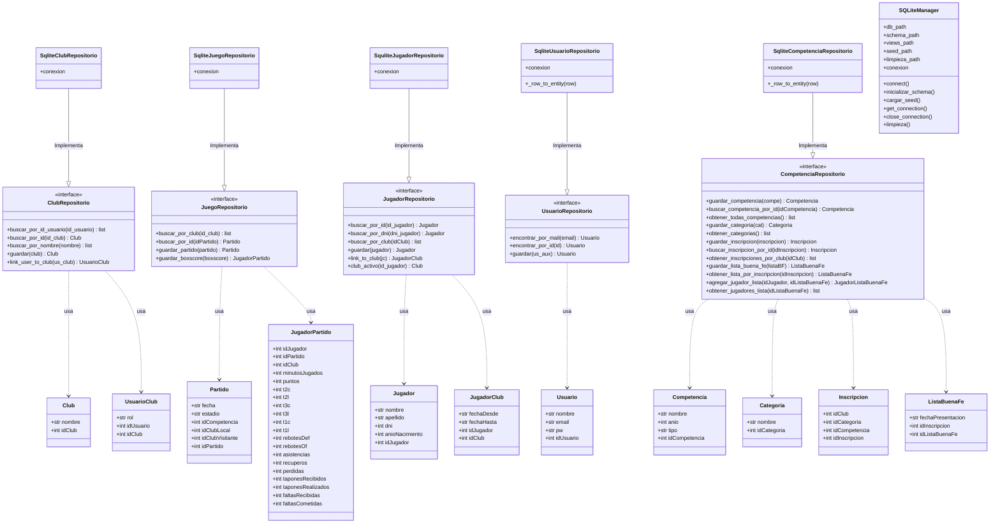
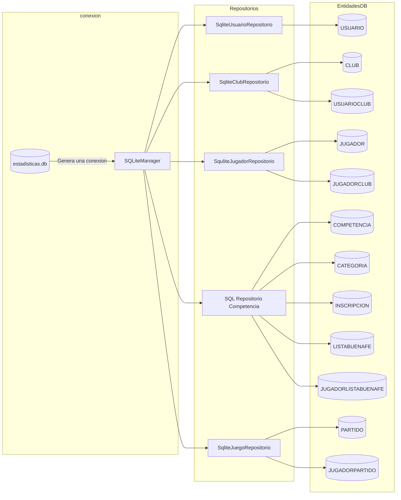
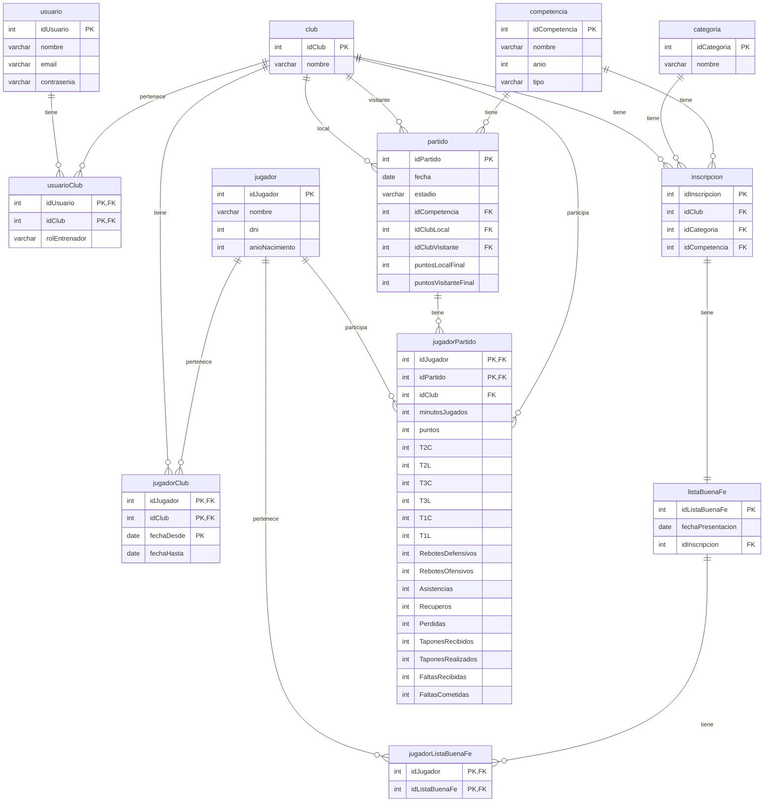

# Diagramas Útiles

## Diagrama de Clases

```mermaid
classDiagram
    SqliteClubRepositorio --|> ClubRepositorio : Implementa
    SqliteJuegoRepositorio --|> JuegoRepositorio : Implementa
    SquliteJugadorRepositorio --|> JugadorRepositorio : Implementa
    SqliteUsuarioRepositorio --|> UsuarioRepositorio : Implementa
    SqliteCompetenciaRepositorio --|> CompetenciaRepositorio : Implementa

    ClubRepositorio ..> Club : usa
    ClubRepositorio ..> UsuarioClub : usa
    CompetenciaRepositorio ..> Competencia : usa
    CompetenciaRepositorio ..> Categoria : usa
    CompetenciaRepositorio ..> Inscripcion : usa
    CompetenciaRepositorio ..> ListaBuenaFe : usa
    UsuarioRepositorio ..> Usuario : usa
    JuegoRepositorio ..> Partido : usa
    JuegoRepositorio ..> JugadorPartido : usa
    JugadorRepositorio ..> Jugador : usa
    JugadorRepositorio ..> JugadorClub : usa

    class ClubRepositorio {
        <<interface>>
        +buscar_por_id_usuario(id_usuario) list
        +buscar_por_id(id_club) Club
        +buscar_por_nombre(nombre) list
        +guardar(club) Club
        +link_user_to_club(us_club) UsuarioClub
    }

    class CompetenciaRepositorio {
        <<interface>>
        +guardar_competencia(compe) Competencia
        +buscar_competencia_por_id(idCompetencia) Competencia
        +obtener_todas_competencias() list
        +guardar_categoria(cat) Categoria
        +obtener_categorias() list
        +guardar_inscripcion(inscripcion) Inscripcion
        +buscar_inscripcion_por_id(idInscripcion) Inscripcion
        +obtener_inscripciones_por_club(idClub) list
        +guardar_lista_buena_fe(listaBF) ListaBuenaFe
        +obtener_lista_por_inscripcion(idInscripcion) ListaBuenaFe
        +agregar_jugador_lista(idJugador, idListaBuenaFe) JugadorListaBuenaFe
        +obtener_jugadores_lista(idListaBuenaFe) list
    }

    class UsuarioRepositorio {
        <<interface>>
        +encontrar_por_mail(email) Usuario
        +encontrar_por_id(id) Usuario
        +guardar(us_aux) Usuario
    }

    class JuegoRepositorio {
        <<interface>>
        +buscar_por_club(id_club) list
        +buscar_por_id(idPartido) Partido
        +guardar_partido(partido) Partido
        +guardar_boxscore(boxscore) JugadorPartido
    }

    class JugadorRepositorio {
        <<interface>>
        +buscar_por_id(id_jugador) Jugador
        +buscar_por_dni(dni_jugador) Jugador
        +buscar_por_club(idClub) list
        +guardar(jugador) Jugador
        +link_to_club(jc) JugadorClub
        +club_activo(id_jugador) Club
    }

    class Club {
        +str nombre
        +int idClub
    }

    class UsuarioClub {
        +str rol
        +int idUsuario
        +int idClub
    }

    class Competencia {
        +str nombre
        +int anio
        +str tipo
        +int idCompetencia
    }

    class Categoria {
        +str nombre
        +int idCategoria
    }

    class Inscripcion {
        +int idClub
        +int idCategoria
        +int idCompetencia
        +int idInscripcion
    }

    class ListaBuenaFe {
        +str fechaPresentacion
        +int idInscripcion
        +int idListaBuenaFe
    }

    class Usuario {
        +str nombre
        +str email
        +str pw
        +int idUsuario
    }

    class JugadorPartido {
        +int idJugador
        +int idPartido
        +int idClub
        +int minutosJugados
        +int puntos
        +int t2c
        +int t2l
        +int t3c
        +int t3l
        +int t1c
        +int t1l
        +int rebotesDef
        +int rebotesOf
        +int asistencias
        +int recuperos
        +int perdidas
        +int taponesRecibidos
        +int taponesRealizados
        +int faltasRecibidas
        +int faltasCometidas
    }

    class Partido {
        +str fecha
        +str estadio
        +int idCompetencia
        +int idClubLocal
        +int idClubVisitante
        +int idPartido
    }

    class Jugador {
        +str nombre
        +str apellido
        +int dni
        +int anioNacimiento
        +int idJugador
    }

    class JugadorClub {
        +str fechaDesde
        +str fechaHasta
        +int idJugador
        +int idClub
    }

    class SqliteClubRepositorio {
        +conexion
    }

    class SqliteJuegoRepositorio {
        +conexion
    }

    class SquliteJugadorRepositorio {
        +conexion
    }

    class SqliteUsuarioRepositorio {
        +conexion
        +_row_to_entity(row)
    }

    class SqliteCompetenciaRepositorio {
        +conexion
        +_row_to_entity(row)
    }

    class SQLiteManager {
        +db_path
        +schema_path
        +views_path
        +seed_path
        +limpieza_path
        +conexion
        +connect()
        +inicializar_schema()
        +cargar_seed()
        +get_connection()
        +close_connection()
        +limpieza()
    }
```

---

## Diagrama Patrón Repositorio

```mermaid
flowchart LR
    db[(estadisticas.db)]
    dbManager["SQLiteManager"]
    repoUsuario["SqliteUsuarioRepositorio"]
    repoJugador["SquliteJugadorRepositorio"]
    repoJuego["SqliteJuegoRepositorio"]
    repoClub["SqliteClubRepositorio"]
    repoCompetencias["SQL Repositorio Competencia"]

    U[(USUARIO)]
    C[(CLUB)]
    UC[(USUARIOCLUB)]
    J[(JUGADOR)]
    JC[(JUGADORCLUB)]
    COM[(COMPETENCIA)]
    CAT[(CATEGORIA)]
    I[(INSCRIPCION)]
    LBF[(LISTABUENAFE)]
    JLBF[(JUGADORLISTABUENAFE)]
    P[(PARTIDO)]
    JP[(JUGADORPARTIDO)]

    subgraph conexion
        db -->|"Genera una conexion"| dbManager
    end

    subgraph Repositorios
        dbManager --> repoUsuario
        dbManager --> repoJugador
        dbManager --> repoJuego
        dbManager --> repoClub
        dbManager --> repoCompetencias
    end

    subgraph EntidadesDB
        repoUsuario --> U
        repoClub --> C
        repoClub --> UC
        repoCompetencias --> COM
        repoCompetencias --> CAT
        repoCompetencias --> I
        repoCompetencias --> LBF
        repoCompetencias --> JLBF
        repoJuego --> P
        repoJuego --> JP
        repoJugador --> J
        repoJugador --> JC
    end
```

---

## DER (Diagrama Entidad Relación)

```mermaid
erDiagram
    usuario {
        int idUsuario PK
        varchar nombre
        varchar email
        varchar contrasenia
    }
    usuarioClub {
        int idUsuario PK,FK
        int idClub PK,FK
        varchar rolEntrenador
    }
    club {
        int idClub PK
        varchar nombre
    }
    jugadorClub {
        int idJugador PK,FK
        int idClub PK,FK
        date fechaDesde PK
        date fechaHasta
    }
    jugador {
        int idJugador PK
        varchar nombre
        int dni
        int anioNacimiento
    }
    jugadorListaBuenaFe {
        int idJugador PK,FK
        int idListaBuenaFe PK,FK
    }
    listaBuenaFe {
        int idListaBuenaFe PK
        date fechaPresentacion
        int idInscripcion FK
    }
    inscripcion {
        int idInscripcion PK
        int idClub FK
        int idCategoria FK
        int idCompetencia FK
    }
    categoria {
        int idCategoria PK
        varchar nombre
    }
    partido {
        int idPartido PK
        date fecha
        varchar estadio
        int idCompetencia FK
        int idClubLocal FK
        int idClubVisitante FK
        int puntosLocalFinal
        int puntosVisitanteFinal
    }
    jugadorPartido {
        int idJugador PK,FK
        int idPartido PK,FK
        int idClub FK
        int minutosJugados
        int puntos
        int T2C
        int T2L
        int T3C
        int T3L
        int T1C
        int T1L
        int RebotesDefensivos
        int RebotesOfensivos
        int Asistencias
        int Recuperos
        int Perdidas
        int TaponesRecibidos
        int TaponesRealizados
        int FaltasRecibidas
        int FaltasCometidas
    }
    competencia {
        int idCompetencia PK
        varchar nombre
        int anio
        varchar tipo
    }

    usuario ||--o{ usuarioClub : tiene
    club ||--o{ usuarioClub : pertenece
    club ||--o{ jugadorClub : tiene
    club ||--o{ inscripcion : tiene
    club ||--o{ partido : local
    club ||--o{ partido : visitante
    jugador ||--o{ jugadorClub : pertenece
    jugador ||--o{ jugadorListaBuenaFe : pertenece
    jugador ||--o{ jugadorPartido : participa
    listaBuenaFe ||--o{ jugadorListaBuenaFe : tiene
    categoria ||--o{ inscripcion : tiene
    competencia ||--o{ inscripcion : tiene
    inscripcion ||--|| listaBuenaFe : tiene
    partido ||--o{ jugadorPartido : tiene
    club ||--o{ jugadorPartido : participa
    competencia ||--o{ partido : tiene
```
