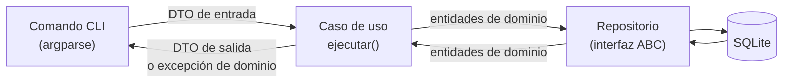
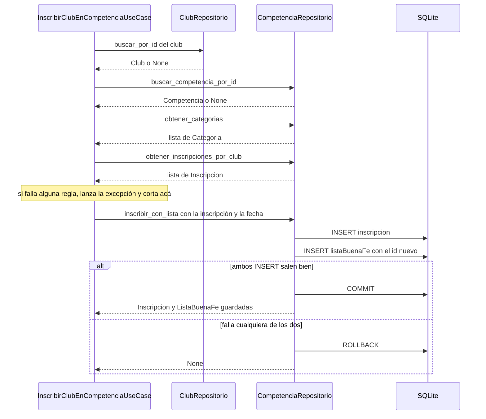

# Casos de uso (capa de aplicación)

Esta guía describe los **17 casos de uso** que existen hoy en `src/aplicacion/casos_uso/`: qué DTO
recibe cada uno, qué DTO devuelve, qué excepciones puede lanzar y, sobre todo, **qué hace paso a
paso** dentro de `ejecutar()`.

Para el _por qué_ de esta capa (qué es un caso de uso, por qué son clases, qué es un DTO) ver
[US103 en Profundidad](../context_ia/2026-08-17-us103-explicada-en-profundidad.md). Esta guía es la
referencia práctica: "qué hace exactamente cada uno".

---

## 1. Dónde encaja un caso de uso

Un caso de uso es **una acción que el usuario puede pedir** ("registrar un jugador", "inscribir un
club en una competencia"). Es el único lugar donde viven las reglas de negocio: el comando de la CLI
no las conoce, y el repositorio solo sabe leer y guardar.



### Convenciones que cumplen los 17 casos de uso

| Convención                              | Qué significa en la práctica                                                                                                                                                                                                                                                                  |
| --------------------------------------- | --------------------------------------------------------------------------------------------------------------------------------------------------------------------------------------------------------------------------------------------------------------------------------------------- |
| **Clase con `ejecutar()`**              | Cada caso de uso es una clase con un único método público, `ejecutar()`.                                                                                                                                                                                                                      |
| **Repositorios por constructor**        | Reciben la **interfaz** (`ClubRepositorio`, `JugadorRepositorio`…), nunca la clase SQLite concreta. Así se pueden testear con un repositorio falso (AC2 de la US-103).                                                                                                                        |
| **DTO de entrada y de salida**          | La CLI nunca ve las entidades de dominio: entra un DTO y sale un DTO.                                                                                                                                    |
| **`None` = no se pudo guardar**         | Si el repositorio devuelve `None`, el caso de uso devuelve `None`. El repositorio ya dejó el detalle del error en el log.                                                                                                                                                                     |
| **Los listados nunca devuelven `None`** | Si no hay resultados devuelven `[]`, así la CLI puede iterar sin chequear.                                                                                                                                                                                                                    |
| **Las excepciones de negocio suben**    | El caso de uso **no** las atrapa: sube hasta el comando CLI, que decide cómo mostrárselas al usuario (sin traceback, AC3).                                                                                                                                                                    |
| **IDs de salida con `id_persistido`**   | Las entidades declaran su ID como `int \| None` (antes de guardarse no lo tienen) pero los DTOs de salida piden `int`. `id_persistido()` (en `src/utils.py`) devuelve el ID o lanza `RuntimeError` si un repositorio devolviera una entidad sin ID. Deja limpio a `mypy --strict`. |
| **Validación gratis al construir**      | Al construir una entidad (`Jugador(...)`, `Club(...)`) su `__post_init__` valida los tipos (`TypeError`, un bug del programa) y los valores (`DatoInvalidoError`, un error del usuario: nombre vacío, DNI negativo, año imposible). Esta última es una `ErrorDeDominio`, así que la CLI la muestra como mensaje.                                                                                                                                                               |

---

## 2. Resumen

| #   | Caso de uso                         | Archivo                         | Entra                           | Sale                            | Repositorios                                |
| --- | ----------------------------------- | ------------------------------- | ------------------------------- | ------------------------------- | ------------------------------------------- |
| 1   | `RegistrarJugadorUseCase`           | `registrar_jugador.py`          | `CrearJugadorDTO`               | `JugadorDTO \| None`            | `JugadorRepositorio`                        |
| 2   | `CrearClubUseCase`                  | `crear_club.py`                 | `CrearClubDTO`                  | `ClubDTO \| None`               | `ClubRepositorio`                           |
| 3   | `VincularJugadorAClubUseCase`       | `vincular_jugador_club.py`      | `VincularJugadorClubDTO`        | `VinculoDTO \| None`            | `JugadorRepositorio`, `ClubRepositorio`     |
| 4   | `CrearCompetenciaUseCase`           | `crear_competencia.py`          | `CrearCompetenciaDTO`           | `CompetenciaDTO \| None`        | `CompetenciaRepositorio`                    |
| 5   | `InscribirClubEnCompetenciaUseCase` | `inscribir_club_competencia.py` | `InscribirClubDTO`              | `InscripcionDTO \| None`        | `CompetenciaRepositorio`, `ClubRepositorio` |
| 6   | `ListarClubesUsuarioUseCase`        | `listar_clubes_usr.py`          | `idUsuario: int`                | `list[ClubDTO]`                 | `ClubRepositorio`                           |
| 7   | `ListarJugadoresClubUseCase`        | `listar_jugador_club.py`        | `idClub: int`                   | `list[JugadorDTO]`              | `JugadorRepositorio`                        |
| 8   | `ListarPartidosPorClubUseCase`      | `partidos_por_club.py`          | `idClub: int`                   | `list[PartidoResumenDTO]`       | `PartidoRepositorio`                        |
| 9   | `CambiarClubActivoUseCase`          | `cambiar_club_activo.py`        | `idUsuario: int`, `idClub: int` | `ClubDTO`                       | `ClubRepositorio`                           |
| 10  | `CrearCategoriaUseCase`              | `crear_categoria.py`            | `CrearCategoriaDTO`             | `CategoriaDTO \| None`         | `CompetenciaRepositorio`                    |
| 11  | `ListarCategoriasUseCase`            | `listar_categorias.py`          | _(nada)_                        | `list[CategoriaDTO]`          | `CompetenciaRepositorio`                    |
| 12  | `ListarCompetenciasUseCase`          | `listar_competencias.py`        | _(nada)_                        | `list[CompetenciaDTO]`        | `CompetenciaRepositorio`                    |
| 13  | `ListarInscripcionesClubUseCase`     | `listar_inscripciones_club.py`  | `idClub: int`                   | `list[InscripcionDTO]`        | `CompetenciaRepositorio`                    |
| 14  | `AgregarJugadorAListaBuenaFeUseCase` | `agregar_jugador_lista.py`      | `AgregarJugadorListaDTO`        | `JugadorEnListaDTO \| None`   | `CompetenciaRepositorio`, `JugadorRepositorio` |
| 15  | `ListarListaBuenaFeUseCase`          | `listar_lista_buena_fe.py`      | `idInscripcion: int`            | `list[JugadorDTO]`            | `CompetenciaRepositorio`, `JugadorRepositorio` |
| 16  | `DesvincularJugadorDeClubUseCase`    | `desvincular_jugador_club.py`   | `DesvincularJugadorDTO`         | `VinculoDTO \| None`          | `JugadorRepositorio`                        |
| 17  | `QuitarJugadorDeListaBuenaFeUseCase` | `quitar_jugador_lista.py`       | `QuitarJugadorListaDTO`         | `JugadorEnListaDTO \| None`   | `CompetenciaRepositorio`                    |

Los listados con un solo dato (6, 7, 8, 13 y 15) reciben un `int` suelto y no un DTO: armar una dataclass de
un campo sería sobre-ingeniería. Los listados 11 y 12 no reciben nada (devuelven todo lo que hay).

---

## 3. Detalle de cada caso de uso

### 3.1 `RegistrarJugadorUseCase`

Registra un jugador nuevo.

- **Constructor:** `RegistrarJugadorUseCase(jugador_repo: JugadorRepositorio)`
- **Entra:** `CrearJugadorDTO(nombre, apellido, dni, anioNacimiento)`
- **Sale:** `JugadorDTO(nombre_completo, id, anioNacimiento)`, o `None` si no se pudo guardar
- **Lanza:** `DNIDuplicadoError` (desde el repositorio), `DatoInvalidoError` / `TypeError` (desde la entidad)

**Paso a paso:**

1. **Arma la entidad** `Jugador(nombre, apellido, dni, anioNacimiento)` con los datos del DTO. Su
   `__post_init__` valida los tipos y los valores: nombre y apellido no vacíos, DNI mayor a 0 y año de
   nacimiento entre 1901 y el año actual (si no → `DatoInvalidoError`).
2. **Le pide al repositorio que la guarde** (`repo.guardar`). Dentro del repositorio: primero busca si
   ya existe un jugador con ese DNI (si existe lanza `DNIDuplicadoError`); si no existe, hace el
   `INSERT` y devuelve el `Jugador` con su `idJugador` asignado.
3. **Si el repositorio devolvió `None`** (falló el `INSERT`), devuelve `None`.
4. **Arma el `JugadorDTO` de salida:** toma `nombre_completo` (propiedad calculada de la entidad, junta
   `nombre` + `apellido`) y copia `idJugador` como `id`.

!!! note "Dónde vive el chequeo de DNI duplicado"
La regla "el DNI es único" la aplica el **repositorio** (`SqliteJugadorRepositorio.guardar`), no el
caso de uso. El caso de uso solo deja que la excepción suba.

---

### 3.2 `CrearClubUseCase`

Crea un club nuevo.

- **Constructor:** `CrearClubUseCase(repo: ClubRepositorio)`
- **Entra:** `CrearClubDTO(nombre)`
- **Sale:** `ClubDTO(idClub, nombre)`, o `None` si no se pudo guardar
- **Lanza:** `DatoInvalidoError` / `TypeError` (desde la entidad)

**Paso a paso:**

1. **Arma la entidad** `Club(nombre=dto.nombre)`. Si el nombre está vacío (o solo espacios) → `DatoInvalidoError`.
2. **Le pide al repositorio que la guarde** (`repo.guardar`), que hace el `INSERT` y devuelve el `Club`
   con su `idClub`.
3. **Si el repositorio devolvió `None`**, devuelve `None`.
4. **Arma el `ClubDTO`** con `idClub` y `nombre` del club guardado.

!!! warning "Lo que todavía NO hace"
No vincula el club con el usuario que lo creó (`ClubRepositorio.link_user_to_club`), así que un club
recién creado no aparece en `ListarClubesUsuarioUseCase`. Ese vínculo necesita el usuario de la
sesión, que llega con la US-104. Tampoco valida nombres duplicados.

---

### 3.3 `VincularJugadorAClubUseCase`

Vincula un jugador a un club (crea una fila del historial `jugadorClub`).

- **Constructor:** `VincularJugadorAClubUseCase(repo_jugador: JugadorRepositorio, repo_club: ClubRepositorio)`
- **Entra:** `VincularJugadorClubDTO(idJugador, idClub, fechaDesde)` (definido en `club_dto.py`)
- **Sale:** `VinculoDTO(idJugador, idClub, fechaDesde, fechaHasta)` (con `fechaHasta=None`: vínculo vigente), o `None` si no se pudo guardar
- **Lanza:** `JugadorNoEncontradoError`, `ClubNoEncontradoError`, `VinculoActivoExistenteError`, `VinculoSuperpuestoError`

**Paso a paso:**

1. **Busca el jugador** (`repo_jugador.buscar_por_id`). Si no existe → `JugadorNoEncontradoError`.
2. **Busca el club** (`repo_club.buscar_por_id`). Si no existe → `ClubNoEncontradoError`.
3. **Averigua si el jugador ya tiene un club activo** (`repo_jugador.club_activo`, que busca un vínculo
   con `fechaHasta IS NULL`). Si tiene uno → `VinculoActivoExistenteError`, indicando en qué club está.
   Esto cubre las dos reglas: no estar en dos clubes a la vez **ni en el mismo club dos veces**.
4. **Revisa que no se superponga con un vínculo anterior:** recorre el historial del jugador
   (`repo_jugador.historial_vinculos`) y, si algún vínculo ya cerrado terminó **después** de la fecha
   de inicio pedida → `VinculoSuperpuestoError`. Sirve para el cambio de club: primero se da de baja el
   vínculo viejo (caso 16) y el nuevo tiene que empezar el mismo día de la baja o después. (Las fechas son
   texto `AAAA-MM-DD`, así que compararlas como texto es compararlas cronológicamente.)
5. **Arma la entidad** `JugadorClub(fechaDesde, fechaHasta=None, idJugador, idClub)`. `fechaHasta=None`
   significa "vínculo vigente".
6. **La guarda** (`repo_jugador.link_to_club`); si devolvió `None` (falló el `INSERT`), devuelve `None`. Si no,
   arma el `VinculoDTO`.

---

### 3.4 `CrearCompetenciaUseCase`

Crea una competencia (ej. "Liga Provincial 2026").

- **Constructor:** `CrearCompetenciaUseCase(repo: CompetenciaRepositorio)`
- **Entra:** `CrearCompetenciaDTO(nombre, anio, tipo=None)`
- **Sale:** `CompetenciaDTO(idCompetencia, nombre, anio, tipo)`, o `None` si no se pudo guardar
- **Lanza:** `DatoInvalidoError` / `TypeError` (desde la entidad)

**Paso a paso:**

1. **Arma la entidad** `Competencia(nombre, anio, tipo)`. Su `__post_init__` valida los tipos, que el
   nombre no esté vacío y que el año sea válido (rechaza años `<= 1900` con `DatoInvalidoError`, el mismo
   criterio que el `CHECK(anio > 1900)` del schema).
2. **La guarda** (`repo.guardar_competencia`), que hace el `INSERT` y devuelve la `Competencia` con su
   `idCompetencia`.
3. **Si el repositorio devolvió `None`**, devuelve `None`.
4. **Arma el `CompetenciaDTO`** con los datos de la competencia guardada.

---

### 3.5 `InscribirClubEnCompetenciaUseCase`

Inscribe un club en una competencia y una categoría, y **genera automáticamente su lista de buena fe
vacía** (relación 1:1). Es el caso de uso con más reglas.

- **Constructor:** `InscribirClubEnCompetenciaUseCase(repo_competencia: CompetenciaRepositorio, repo_club: ClubRepositorio)`
- **Entra:** `InscribirClubDTO(idClub, idCategoria, idCompetencia, fechaPresentacion)`
- **Sale:** `InscripcionDTO(idInscripcion, idClub, idCategoria, idCompetencia, idListaBuenaFe)`, o `None`
  si no se pudo guardar
- **Lanza:** `ClubNoEncontradoError`, `CompetenciaNoEncontradaError`, `CategoriaNoEncontradaError`,
  `InscripcionDuplicadaError`

**Paso a paso:**

1. **Verifica que el club exista** (`repo_club.buscar_por_id`). Si no → `ClubNoEncontradoError`.
2. **Verifica que la competencia exista** (`repo_competencia.buscar_competencia_por_id`). Si no →
   `CompetenciaNoEncontradaError`.
3. **Verifica que la categoría exista:** trae todas (`obtener_categorias`) y busca la que tenga ese
   `idCategoria`. Si no está → `CategoriaNoEncontradaError`.
4. **Verifica que no esté ya inscripto:** trae las inscripciones del club
   (`obtener_inscripciones_por_club`) y busca alguna con la misma competencia **y** la misma categoría.
   Si la hay → `InscripcionDuplicadaError`.
5. **Arma la entidad** `Inscripcion(idClub, idCategoria, idCompetencia)`, todavía sin id.
6. **Guarda inscripción y lista juntas** (`repo_competencia.inscribir_con_lista(inscripcion, fechaPresentacion)`).
   Es **una sola transacción atómica** (AC5): se hace el `INSERT` de la inscripción, luego el de la
   lista de buena fe con el id recién generado, y recién ahí el `COMMIT`. Si cualquiera de los dos
   falla, se hace `ROLLBACK` de los dos y el repositorio devuelve `None`.
7. **Si devolvió `None`**, devuelve `None`.
8. **Arma el `InscripcionDTO`** con los ids de la inscripción guardada y el `idListaBuenaFe` de su lista
   (confirma que la lista se creó junto con la inscripción).



!!! note "Por qué el duplicado se valida en el caso de uso"
La tabla `inscripcion` no tiene una restricción `UNIQUE (idClub, idCategoria, idCompetencia)`, así
que la base aceptaría la inscripción repetida. La regla se aplica acá.

---

### 3.6 `ListarClubesUsuarioUseCase`

Lista los clubes a los que pertenece un usuario.

- **Constructor:** `ListarClubesUsuarioUseCase(repo: ClubRepositorio)`
- **Entra:** `idUsuario: int`
- **Sale:** `list[ClubDTO]` (lista vacía si el usuario no pertenece a ningún club)
- **Lanza:** nada

**Paso a paso:**

1. **Le pide al repositorio los clubes del usuario** (`repo.buscar_por_id_usuario`), que hace un `JOIN`
   con la tabla `usuarioClub`.
2. **Si no hay resultados** (el repositorio devuelve `None`), devuelve `[]`.
3. **Convierte cada `Club` en un `ClubDTO(idClub, nombre)`** y devuelve la lista.

---

### 3.7 `ListarJugadoresClubUseCase`

Lista los jugadores de un club.

- **Constructor:** `ListarJugadoresClubUseCase(repo: JugadorRepositorio)`
- **Entra:** `idClub: int`
- **Sale:** `list[JugadorDTO]` (lista vacía si el club no tiene jugadores)
- **Lanza:** nada

**Paso a paso:**

1. **Le pide al repositorio los jugadores del club** (`repo.buscar_por_club`), que hace un `JOIN` entre
   `jugadorClub` y `jugador` **filtrando por vínculo vigente** (`fechaHasta IS NULL`). Si devuelve
   `None`, se toma como lista vacía.
2. **Convierte cada `Jugador` en un `JugadorDTO`:** junta `nombre` + `apellido` en `nombre_completo`,
   y copia `idJugador` como `id` y `anioNacimiento`.

!!! note "Solo jugadores actuales"
Un jugador cuyo vínculo con el club ya se cerró (tiene `fechaHasta`) **no** aparece en el listado.
El historial completo sigue guardado en la tabla `jugadorClub`.

---

### 3.8 `ListarPartidosPorClubUseCase`

Lista los partidos en los que participó un club, ya sea como local o como visitante.

- **Constructor:** `ListarPartidosPorClubUseCase(repo: PartidoRepositorio)`
- **Entra:** `idClub: int`
- **Sale:** `list[PartidoResumenDTO]` (lista vacía si el club no tiene partidos)
- **Lanza:** nada

**Paso a paso:**

1. **Le pide al repositorio el resumen de los partidos del club** (`repo.resumen_por_club`), que lee la vista
   `v_partidos_resumen` (ya trae los nombres, sin `JOIN` en el código) filtrando donde el club sea local **o**
   visitante, del más antiguo al más reciente.
2. **Convierte cada `PartidoResumen` en un `PartidoResumenDTO`** con `idPartido`, `fecha`, `estadio`,
   `competencia`, `anioCompetencia`, `clubLocal` y `clubVisitante` (nombres, no ids).

!!! note "Por qué no usa `buscar_por_club`"
    `buscar_por_club` devuelve entidades `Partido` que solo tienen los ids de los clubes. Para mostrar
    nombres habría que consultar cada club uno por uno; la vista ya lo resuelve en una sola consulta.

---

### 3.9 `CambiarClubActivoUseCase`

Valida que un usuario pueda pasar a trabajar con un club (el "club activo" de la sesión).

- **Constructor:** `CambiarClubActivoUseCase(repo: ClubRepositorio)`
- **Entra:** `idUsuario: int`, `idClub: int`
- **Sale:** `ClubDTO(idClub, nombre)` del club a activar
- **Lanza:** `ClubNoEncontradoError`

**Paso a paso:**

1. **Trae los clubes del usuario** (`repo.buscar_por_id_usuario`). Si devuelve `None`, se toma como
   lista vacía.
2. **Recorre esos clubes buscando el que tenga el `idClub` pedido.**
3. **Si lo encuentra,** devuelve su `ClubDTO`.
4. **Si no lo encuentra,** lanza `ClubNoEncontradoError`. Esto cubre tanto un club que no existe como un
   club que existe pero al que el usuario no pertenece.

!!! note "Solo valida, no guarda la sesión"
Este caso de uso solo aplica la regla de negocio. Guardar el club elegido en la sesión es trabajo del
`SessionManager` de la US-104, que usará el `ClubDTO` que devuelve `ejecutar`.

---

### 3.10 `CrearCategoriaUseCase`

Crea una categoría (ej. `U21`, `Primera`). Sin categorías no se puede inscribir a ningún club en una competencia.

- **Constructor:** `CrearCategoriaUseCase(repo: CompetenciaRepositorio)`
- **Entra:** `CrearCategoriaDTO(nombre)`
- **Sale:** `CategoriaDTO(idCategoria, nombre)`, o `None` si no se pudo guardar
- **Lanza:** `CategoriaDuplicadaError`, `TypeError` (desde la entidad)

**Paso a paso:**

1. **Arma la entidad** `Categoria(nombre)`. Su `__post_init__` valida que el nombre sea un texto.
2. **Busca las categorías existentes** (`repo.obtener_categorias`) y compara los nombres **sin distinguir mayúsculas ni espacios de los
   extremos**: `"u21 "` es la misma categoría que `"U21"`. Si ya existe → `CategoriaDuplicadaError` (la tabla no tiene `UNIQUE` sobre el nombre, así que la regla se aplica acá).
3. **La guarda** (`repo.guardar_categoria`). Si devolvió `None`, devuelve `None`.
4. **Arma el `CategoriaDTO`** con el id asignado.

---

### 3.11 `ListarCategoriasUseCase`

- **Constructor:** `ListarCategoriasUseCase(repo: CompetenciaRepositorio)`
- **Entra:** nada
- **Sale:** `list[CategoriaDTO]` (lista vacía si todavía no hay ninguna)
- **Lanza:** nada

**Paso a paso:** (1) pide todas las categorías (`repo.obtener_categorias`); (2) convierte cada una en un `CategoriaDTO`. Sirve para conocer el `--id-categoria` que pide `competencia inscribir`.

---

### 3.12 `ListarCompetenciasUseCase`

- **Constructor:** `ListarCompetenciasUseCase(repo: CompetenciaRepositorio)`
- **Entra:** nada
- **Sale:** `list[CompetenciaDTO]` (lista vacía si todavía no hay ninguna)
- **Lanza:** nada

**Paso a paso:** (1) pide todas las competencias (`repo.obtener_todas_competencias`); (2) convierte cada una en un `CompetenciaDTO`. Sirve para conocer el `--id-competencia` que pide `competencia inscribir`.

---

### 3.13 `ListarInscripcionesClubUseCase`

Lista las inscripciones de un club **junto con el id de la lista de buena fe de cada una** (es el dato que hace falta para administrar esa lista).

- **Constructor:** `ListarInscripcionesClubUseCase(repo: CompetenciaRepositorio)`
- **Entra:** `idClub: int`
- **Sale:** `list[InscripcionDTO]` (lista vacía si el club no tiene inscripciones)
- **Lanza:** `ListaBuenaFeNoEncontradaError` (solo ante una inconsistencia de datos)

**Paso a paso:**

1. **Pide las inscripciones del club** (`repo.obtener_inscripciones_por_club`).
2. **Por cada una, busca su lista de buena fe** (`repo.obtener_lista_por_inscripcion`). Si alguna no tiene → `ListaBuenaFeNoEncontradaError` (la relación es 1:1: no debería pasar).
3. **Arma un `InscripcionDTO`** con los ids de la inscripción y el `idListaBuenaFe`.

---

### 3.14 `AgregarJugadorAListaBuenaFeUseCase`

Habilita a un jugador en la **lista de buena fe** de una inscripción. Solo los jugadores habilitados en la lista pueden figurar en la carga oficial de un partido.

- **Constructor:** `AgregarJugadorAListaBuenaFeUseCase(repo_competencia: CompetenciaRepositorio, repo_jugador: JugadorRepositorio)`
- **Entra:** `AgregarJugadorListaDTO(idInscripcion, idJugador)`
- **Sale:** `JugadorEnListaDTO(idListaBuenaFe, idInscripcion, idJugador)`, o `None` si no se pudo guardar
- **Lanza:** `InscripcionNoEncontradaError`, `ListaBuenaFeNoEncontradaError`, `JugadorNoEncontradoError`, `JugadorNoPerteneceAlClubError`, `JugadorYaEnListaError`

**Paso a paso:**

1. **Busca la inscripción** (`repo_competencia.buscar_inscripcion_por_id`). Si no existe → `InscripcionNoEncontradaError`.
2. **Busca su lista de buena fe** (`repo_competencia.obtener_lista_por_inscripcion`). Si no tiene → `ListaBuenaFeNoEncontradaError`.
3. **Busca el jugador** (`repo_jugador.buscar_por_id`). Si no existe → `JugadorNoEncontradoError`.
4. **Verifica que el jugador juegue hoy en el club de la inscripción:** consulta su club activo (`repo_jugador.club_activo`, el vínculo con `fechaHasta IS NULL`).
   Si no tiene club activo, o es otro club → `JugadorNoPerteneceAlClubError`.
5. **Verifica que no esté ya en la lista:** trae los jugadores de la lista (`repo_competencia.obtener_jugadores_lista`). Si ya figura → `JugadorYaEnListaError`.
6. **Lo agrega** (`repo_competencia.agregar_jugador_lista`). Si devolvió `None`, devuelve `None`; si no, arma el `JugadorEnListaDTO`.

!!! warning "Regla propuesta, no estaba en el PRD"
    La regla del paso 4 (el jugador debe tener vínculo vigente con el club de la inscripción) se propuso al implementar este caso de uso, para evitar listas con jugadores de otros clubes.
    Si el negocio admite excepciones (préstamos, por ejemplo), es el lugar donde relajarla.

!!! note "Para deshacer una habilitación"
    Ver el caso de uso 17 (`QuitarJugadorDeListaBuenaFeUseCase`).

---

### 3.15 `ListarListaBuenaFeUseCase`

- **Constructor:** `ListarListaBuenaFeUseCase(repo_competencia: CompetenciaRepositorio, repo_jugador: JugadorRepositorio)`
- **Entra:** `idInscripcion: int`
- **Sale:** `list[JugadorDTO]` (lista vacía si todavía no se habilitó a nadie)
- **Lanza:** `InscripcionNoEncontradaError`, `ListaBuenaFeNoEncontradaError`, `JugadorNoEncontradoError` (esta última, solo ante una inconsistencia de datos)

**Paso a paso:**

1. **Busca la inscripción** y **su lista de buena fe** (mismos chequeos que el caso de uso 14).
2. **Trae los jugadores de la lista** (`repo_competencia.obtener_jugadores_lista`): solo vienen ids.
3. **Por cada id, busca el jugador** (`repo_jugador.buscar_por_id`) para obtener su nombre y arma un `JugadorDTO`.

---

### 3.16 `DesvincularJugadorDeClubUseCase`

Da de baja el vínculo vigente de un jugador con su club (cierra la fila del historial `jugadorClub` poniéndole `fechaHasta`). Es lo que permite que un jugador **cambie de club**: sin esto, quedaba vinculado para siempre al primero.

- **Constructor:** `DesvincularJugadorDeClubUseCase(repo_jugador: JugadorRepositorio)`
- **Entra:** `DesvincularJugadorDTO(idJugador, fechaHasta)`
- **Sale:** `VinculoDTO(idJugador, idClub, fechaDesde, fechaHasta)` con el vínculo ya cerrado, o `None` si no se pudo guardar
- **Lanza:** `JugadorNoEncontradoError`, `JugadorSinVinculoActivoError`, `DatoInvalidoError`

**Paso a paso:**

1. **Busca el jugador** (`repo_jugador.buscar_por_id`). Si no existe → `JugadorNoEncontradoError`.
2. **Busca su vínculo vigente** en el historial (`repo_jugador.historial_vinculos`, el que tiene `fechaHasta` vacía).
   Si no hay ninguno → `JugadorSinVinculoActivoError`.
3. **Verifica la fecha de baja:** no puede ser anterior al inicio del vínculo (`dto.fechaHasta < vigente.fechaDesde`
   → `DatoInvalidoError`). El schema también lo impide con un `CHECK`, pero acá se avisa con un mensaje claro.
4. **Cierra el vínculo** (`repo_jugador.cerrar_vinculo`). Si devolvió `None`, devuelve `None`; si no, arma el `VinculoDTO`.

El jugador y el club **no se borran**: el historial queda guardado y el jugador puede vincularse a otro club (caso 3).

---

### 3.17 `QuitarJugadorDeListaBuenaFeUseCase`

Quita a un jugador de la lista de buena fe de una inscripción (deshace una habilitación por error, o una baja).

- **Constructor:** `QuitarJugadorDeListaBuenaFeUseCase(repo_competencia: CompetenciaRepositorio)`
- **Entra:** `QuitarJugadorListaDTO(idInscripcion, idJugador)`
- **Sale:** `JugadorEnListaDTO(idListaBuenaFe, idInscripcion, idJugador)` del jugador quitado, o `None` si no se pudo quitar
- **Lanza:** `InscripcionNoEncontradaError`, `ListaBuenaFeNoEncontradaError`, `JugadorNoEstaEnListaError`

**Paso a paso:**

1. **Busca la inscripción** (`repo_competencia.buscar_inscripcion_por_id`). Si no existe → `InscripcionNoEncontradaError`.
2. **Busca su lista de buena fe** (`repo_competencia.obtener_lista_por_inscripcion`). Si no tiene → `ListaBuenaFeNoEncontradaError`.
3. **Verifica que el jugador esté en la lista** (`repo_competencia.obtener_jugadores_lista`). Si no está → `JugadorNoEstaEnListaError`.
4. **Lo quita** (`repo_competencia.quitar_jugador_lista`). Si no se pudo (`False`), devuelve `None`; si no, arma el `JugadorEnListaDTO`.

Solo se deshace la habilitación en esa lista: el jugador sigue existiendo y sigue en su club.

---

## 4. DTOs

Todos son `@dataclass` simples, sin lógica, en `src/aplicacion/dtos/`.

| Archivo              | DTO                      | Campos                                                                             | Dirección | Lo usa                                                                       |
| -------------------- | ------------------------ | ---------------------------------------------------------------------------------- | --------- | ---------------------------------------------------------------------------- |
| `jugador_dto.py`     | `CrearJugadorDTO`        | `nombre`, `apellido`, `dni`, `anioNacimiento`                                      | entrada   | `RegistrarJugadorUseCase`                                                    |
| `jugador_dto.py`     | `JugadorDTO`             | `nombre_completo`, `id`, `anioNacimiento`                                          | salida    | `RegistrarJugadorUseCase`, `ListarJugadoresClubUseCase`, `ListarListaBuenaFeUseCase` |
| `club_dto.py`        | `CrearClubDTO`           | `nombre`                                                                           | entrada   | `CrearClubUseCase`                                                           |
| `club_dto.py`        | `ClubDTO`                | `idClub`, `nombre`                                                                 | salida    | `CrearClubUseCase`, `ListarClubesUsuarioUseCase`, `CambiarClubActivoUseCase` |
| `club_dto.py`        | `VincularJugadorClubDTO` | `idJugador`, `idClub`, `fechaDesde`                                                | entrada   | `VincularJugadorAClubUseCase`                                                |
| `club_dto.py`        | `DesvincularJugadorDTO`  | `idJugador`, `fechaHasta`                                                          | entrada   | `DesvincularJugadorDeClubUseCase`                                            |
| `club_dto.py`        | `VinculoDTO`             | `idJugador`, `idClub`, `fechaDesde`, `fechaHasta` (`None` si sigue vigente)        | salida    | `VincularJugadorAClubUseCase`, `DesvincularJugadorDeClubUseCase`             |
| `competencia_dto.py` | `CrearCompetenciaDTO`    | `nombre`, `anio`, `tipo` (opcional)                                                | entrada   | `CrearCompetenciaUseCase`                                                    |
| `competencia_dto.py` | `CompetenciaDTO`         | `idCompetencia`, `nombre`, `anio`, `tipo`                                          | salida    | `CrearCompetenciaUseCase`, `ListarCompetenciasUseCase` |
| `competencia_dto.py` | `InscribirClubDTO`       | `idClub`, `idCategoria`, `idCompetencia`, `fechaPresentacion`                      | entrada   | `InscribirClubEnCompetenciaUseCase`                                          |
| `competencia_dto.py` | `InscripcionDTO`         | `idInscripcion`, `idClub`, `idCategoria`, `idCompetencia`, `idListaBuenaFe`        | salida    | `InscribirClubEnCompetenciaUseCase`, `ListarInscripcionesClubUseCase` |
| `partido_dto.py`     | `PartidoResumenDTO`      | `idPartido`, `fecha`, `estadio`, `competencia`, `anioCompetencia`, `clubLocal`, `clubVisitante` | salida    | `ListarPartidosPorClubUseCase`                                  |
| `categoria_dto.py`    | `CrearCategoriaDTO`      | `nombre`                                                                           | entrada   | `CrearCategoriaUseCase` |
| `categoria_dto.py`    | `CategoriaDTO`           | `idCategoria`, `nombre`                                                            | salida    | `CrearCategoriaUseCase`, `ListarCategoriasUseCase` |
| `lista_buena_fe_dto.py` | `AgregarJugadorListaDTO` | `idInscripcion`, `idJugador`                                                     | entrada   | `AgregarJugadorAListaBuenaFeUseCase` |
| `lista_buena_fe_dto.py` | `QuitarJugadorListaDTO` | `idInscripcion`, `idJugador`                                                    | entrada   | `QuitarJugadorDeListaBuenaFeUseCase` |
| `lista_buena_fe_dto.py` | `JugadorEnListaDTO`    | `idListaBuenaFe`, `idInscripcion`, `idJugador`                                     | salida    | `AgregarJugadorAListaBuenaFeUseCase`, `QuitarJugadorDeListaBuenaFeUseCase` |

---

## 5. Excepciones de dominio

Definidas en `src/dominio/exceptions.py`. Todas heredan de `ErrorDeDominio`, así que la CLI puede
capturarlas juntas con un solo `except ErrorDeDominio`.

| Excepción                                                | La lanza                                                                                       | Cuándo                                                                      |
| -------------------------------------------------------- | ---------------------------------------------------------------------------------------------- | --------------------------------------------------------------------------- |
| `DNIDuplicadoError`                                      | `SqliteJugadorRepositorio.guardar` (vía `RegistrarJugadorUseCase`)                             | Ya existe un jugador con ese DNI                                            |
| `JugadorNoEncontradoError`                               | `VincularJugadorAClubUseCase`, `DesvincularJugadorDeClubUseCase`, `AgregarJugadorAListaBuenaFeUseCase`, `ListarListaBuenaFeUseCase` | El `idJugador` no existe                                                    |
| `ClubNoEncontradoError`                                  | `VincularJugadorAClubUseCase`, `InscribirClubEnCompetenciaUseCase`, `CambiarClubActivoUseCase` | El club no existe (o, en `CambiarClubActivo`, el usuario no pertenece a él) |
| `VinculoActivoExistenteError`                            | `VincularJugadorAClubUseCase`                                                                  | El jugador ya tiene un club activo (el mismo u otro)                        |
| `VinculoSuperpuestoError`                                | `VincularJugadorAClubUseCase`                                                                  | El vínculo nuevo empieza antes de que termine uno anterior del jugador      |
| `JugadorSinVinculoActivoError`                           | `DesvincularJugadorDeClubUseCase`                                                              | El jugador no tiene un club activo al que darle de baja                     |
| `JugadorNoEstaEnListaError`                              | `QuitarJugadorDeListaBuenaFeUseCase`                                                           | El jugador no está en la lista de buena fe de esa inscripción               |
| `DatoInvalidoError`                                      | Las entidades (`__post_init__`) y `DesvincularJugadorDeClubUseCase`                            | Un valor del tipo correcto pero inválido: nombre vacío, DNI ≤ 0, año imposible, fecha de baja anterior al inicio |
| `CompetenciaNoEncontradaError`                           | `InscribirClubEnCompetenciaUseCase`                                                            | La competencia no existe                                                    |
| `CategoriaNoEncontradaError`                             | `InscribirClubEnCompetenciaUseCase`                                                            | La categoría no existe                                                      |
| `InscripcionDuplicadaError`                              | `InscribirClubEnCompetenciaUseCase`                                                            | El club ya está inscripto en esa competencia y categoría                    |
| `UsuarioNoEncontradoError`, `CredencialesInvalidasError` | _(todavía nadie)_                                                                              | Se usan a partir de la US-104 (autenticación)                               |
| `CategoriaDuplicadaError` | `CrearCategoriaUseCase` | Ya existe una categoría con ese nombre (sin distinguir mayúsculas ni espacios de los extremos) |
| `InscripcionNoEncontradaError` | `AgregarJugadorAListaBuenaFeUseCase`, `QuitarJugadorDeListaBuenaFeUseCase`, `ListarListaBuenaFeUseCase` | La inscripción no existe |
| `ListaBuenaFeNoEncontradaError` | `AgregarJugadorAListaBuenaFeUseCase`, `QuitarJugadorDeListaBuenaFeUseCase`, `ListarListaBuenaFeUseCase`, `ListarInscripcionesClubUseCase` | La inscripción no tiene lista de buena fe (no debería pasar: es 1:1 y se crean juntas) |
| `JugadorNoPerteneceAlClubError` | `AgregarJugadorAListaBuenaFeUseCase` | El jugador no tiene un vínculo vigente con el club de la inscripción |
| `JugadorYaEnListaError` | `AgregarJugadorAListaBuenaFeUseCase` | El jugador ya está habilitado en esa lista |

Además, las entidades pueden lanzar `TypeError` (tipo incorrecto) al construirse. Esa **no** es una excepción
de dominio: es un error de programación (un bug), no algo que el usuario pueda corregir, y no se atrapa.
`DatoInvalidoError` sí es de dominio, y además hereda de `ValueError`: así el código que ya capturaba
`ValueError` sigue funcionando, y `main()` la muestra como un mensaje más.

---

## 6. Cómo se usa un caso de uso

El armado de dependencias lo hace quien invoca (hoy, el comando CLI), nunca el caso de uso:

```python
conexion = SQLiteManager(r.DB_FILE, r.SCHEMA_SQL, r.VISTA_SQL).connect()

# Un repositorio: casos de uso 1, 2, 4, 6, 7, 8, 9, 10, 11, 12, 13, 16 y 17
caso_uso = RegistrarJugadorUseCase(SqliteJugadorRepositorio(conexion))
jugador = caso_uso.ejecutar(CrearJugadorDTO(nombre="Manu", apellido="Ginobili", dni=20111222, anioNacimiento=1977))

# Dos repositorios: casos de uso 3, 5, 14 y 15
caso_uso = InscribirClubEnCompetenciaUseCase(
    repo_competencia=SqliteCompetenciaRepositorio(conexion),
    repo_club=SqliteClubRepositorio(conexion),
)
```

En un test se pasa un repositorio falso en lugar del SQLite: como el constructor recibe la interfaz, el
caso de uso no se entera de la diferencia.

## 7. Estado en la CLI

| Caso de uso                          | Comando CLI                   | Estado                                                        |
| ------------------------------------ | ----------------------------- | ------------------------------------------------------------- |
| `RegistrarJugadorUseCase`            | `stats jugador add`           | ✅ Implementado                                               |
| `CrearClubUseCase`                   | `stats club add`              | ✅ Implementado                                               |
| `VincularJugadorAClubUseCase`        | `stats jugador link`          | ✅ Implementado                                               |
| `CrearCompetenciaUseCase`            | `stats competencia add`       | ✅ Implementado                                               |
| `InscribirClubEnCompetenciaUseCase`  | `stats competencia inscribir` | ✅ Implementado                                               |
| `ListarClubesUsuarioUseCase`         | `stats club list`             | ✅ Implementado (con `--id-usuario` provisorio hasta la US-104) |
| `ListarJugadoresClubUseCase`         | `stats jugador list`          | ✅ Implementado                                               |
| `ListarPartidosPorClubUseCase`       | `stats partido list`          | ✅ Implementado                                               |
| `CambiarClubActivoUseCase`           | `stats club select`           | ⬜ Pendiente (necesita el `SessionManager` de la US-104)      |
| `CrearCategoriaUseCase`              | `stats categoria add`         | ✅ Implementado                                               |
| `ListarCategoriasUseCase`            | `stats categoria list`        | ✅ Implementado                                               |
| `ListarCompetenciasUseCase`          | `stats competencia list`      | ✅ Implementado                                               |
| `ListarInscripcionesClubUseCase`     | `stats inscripcion list`      | ✅ Implementado                                               |
| `AgregarJugadorAListaBuenaFeUseCase` | `stats lista add`             | ✅ Implementado                                               |
| `ListarListaBuenaFeUseCase`          | `stats lista list`            | ✅ Implementado                                               |
| `DesvincularJugadorDeClubUseCase`    | `stats jugador unlink`        | ✅ Implementado                                               |
| `QuitarJugadorDeListaBuenaFeUseCase` | `stats lista remove`          | ✅ Implementado                                               |

La referencia de uso de cada comando (opciones, ejemplos, errores) está en el [RUNBOOK](../../RUNBOOK.md).
