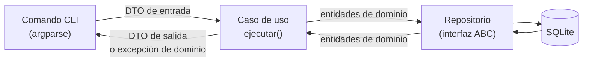
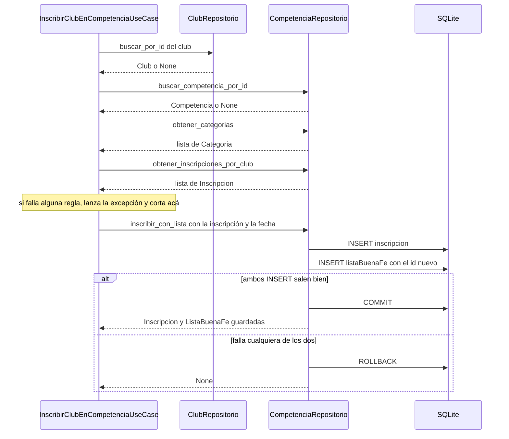

# Casos de uso (capa de aplicación)

Esta guía describe los **9 casos de uso** que existen hoy en `src/aplicacion/casos_uso/`: qué DTO
recibe cada uno, qué DTO devuelve, qué excepciones puede lanzar y, sobre todo, **qué hace paso a
paso** dentro de `ejecutar()`.

Para el _por qué_ de esta capa (qué es un caso de uso, por qué son clases, qué es un DTO) ver
[US103 en Profundidad](../context_ia/2026-08-17-us103-explicada-en-profundidad.md). Esta guía es la
referencia práctica: "qué hace exactamente cada uno".

---

## 1. Dónde encaja un caso de uso

Un caso de uso es **una acción que el usuario puede pedir** ("registrar un jugador", "inscribir un
club en una competencia"). Es el único lugar donde viven las reglas de negocio: el comando de la CLI
no las conoce, y el repositorio solo sabe leer y guardar.



### Convenciones que cumplen los 9 casos de uso

| Convención                              | Qué significa en la práctica                                                                                                                                                                                                                                                                  |
| --------------------------------------- | --------------------------------------------------------------------------------------------------------------------------------------------------------------------------------------------------------------------------------------------------------------------------------------------- |
| **Clase con `ejecutar()`**              | Cada caso de uso es una clase con un único método público, `ejecutar()`.                                                                                                                                                                                                                      |
| **Repositorios por constructor**        | Reciben la **interfaz** (`ClubRepositorio`, `JugadorRepositorio`…), nunca la clase SQLite concreta. Así se pueden testear con un repositorio falso (AC2 de la US-103).                                                                                                                        |
| **DTO de entrada y de salida**          | La CLI nunca ve las entidades de dominio: entra un DTO y sale un DTO. (Excepción actual: `VincularJugadorAClubUseCase` devuelve la entidad `JugadorClub`).                                                                                                                                    |
| **`None` = no se pudo guardar**         | Si el repositorio devuelve `None`, el caso de uso devuelve `None`. El repositorio ya dejó el detalle del error en el log.                                                                                                                                                                     |
| **Los listados nunca devuelven `None`** | Si no hay resultados devuelven `[]`, así la CLI puede iterar sin chequear.                                                                                                                                                                                                                    |
| **Las excepciones de negocio suben**    | El caso de uso **no** las atrapa: sube hasta el comando CLI, que decide cómo mostrárselas al usuario (sin traceback, AC3).                                                                                                                                                                    |
| **IDs de salida con `id_persistido`**   | Las entidades declaran su ID como `int \| None` (antes de guardarse no lo tienen) pero los DTOs de salida piden `int`. `id_persistido()` (en `src/aplicacion/utils.py`) devuelve el ID o lanza `RuntimeError` si un repositorio devolviera una entidad sin ID. Deja limpio a `mypy --strict`. |
| **Validación de tipos gratis**          | Al construir una entidad (`Jugador(...)`, `Club(...)`) su `__post_init__` valida tipos y puede lanzar `TypeError`/`ValueError`.                                                                                                                                                               |

---

## 2. Resumen

| #   | Caso de uso                         | Archivo                         | Entra                           | Sale                            | Repositorios                                |
| --- | ----------------------------------- | ------------------------------- | ------------------------------- | ------------------------------- | ------------------------------------------- |
| 1   | `RegistrarJugadorUseCase`           | `registrar_jugador.py`          | `CrearJugadorDTO`               | `JugadorDTO \| None`            | `JugadorRepositorio`                        |
| 2   | `CrearClubUseCase`                  | `crear_club.py`                 | `CrearClubDTO`                  | `ClubDTO \| None`               | `ClubRepositorio`                           |
| 3   | `VincularJugadorAClubUseCase`       | `vincular_jugador_club.py`      | `VincularJugadorClubDTO`        | `JugadorClub \| None` (entidad) | `JugadorRepositorio`, `ClubRepositorio`     |
| 4   | `CrearCompetenciaUseCase`           | `crear_competencia.py`          | `CrearCompetenciaDTO`           | `CompetenciaDTO \| None`        | `CompetenciaRepositorio`                    |
| 5   | `InscribirClubEnCompetenciaUseCase` | `inscribir_club_competencia.py` | `InscribirClubDTO`              | `InscripcionDTO \| None`        | `CompetenciaRepositorio`, `ClubRepositorio` |
| 6   | `ListarClubesUsuarioUseCase`        | `listar_clubes_usr.py`          | `idUsuario: int`                | `list[ClubDTO]`                 | `ClubRepositorio`                           |
| 7   | `ListarJugadoresClubUseCase`        | `listar_jugador_club.py`        | `idClub: int`                   | `list[JugadorDTO]`              | `JugadorRepositorio`                        |
| 8   | `ListarPartidosPorClubUseCase`      | `partidos_por_club.py`          | `idClub: int`                   | `list[PartidoDTO]`              | `PartidoRepositorio`                        |
| 9   | `CambiarClubActivoUseCase`          | `cambiar_club_activo.py`        | `idUsuario: int`, `idClub: int` | `ClubDTO`                       | `ClubRepositorio`                           |

Los listados (6, 7 y 8) reciben un `int` suelto y no un DTO: con un solo dato, armar una dataclass de
un campo sería sobre-ingeniería.

---

## 3. Detalle de cada caso de uso

### 3.1 `RegistrarJugadorUseCase`

Registra un jugador nuevo.

- **Constructor:** `RegistrarJugadorUseCase(jugador_repo: JugadorRepositorio)`
- **Entra:** `CrearJugadorDTO(nombre, apellido, dni, anioNacimiento)`
- **Sale:** `JugadorDTO(nombre_completo, id, anioNacimiento)`, o `None` si no se pudo guardar
- **Lanza:** `DNIDuplicadoError` (desde el repositorio), `TypeError` (desde la entidad)

**Paso a paso:**

1. **Arma la entidad** `Jugador(nombre, apellido, dni, anioNacimiento)` con los datos del DTO. Su
   `__post_init__` valida los tipos.
2. **Le pide al repositorio que la guarde** (`repo.guardar`). Dentro del repositorio: primero busca si
   ya existe un jugador con ese DNI (si existe lanza `DNIDuplicadoError`); si no existe, hace el
   `INSERT` y devuelve el `Jugador` con su `idJugador` asignado.
3. **Si el repositorio devolvió `None`** (falló el `INSERT`), devuelve `None`.
4. **Arma el `JugadorDTO` de salida:** junta `nombre` + `apellido` en `nombre_completo` y copia
   `idJugador` como `id`.

!!! note "Dónde vive el chequeo de DNI duplicado"
La regla "el DNI es único" la aplica el **repositorio** (`SqliteJugadorRepositorio.guardar`), no el
caso de uso. El caso de uso solo deja que la excepción suba.

---

### 3.2 `CrearClubUseCase`

Crea un club nuevo.

- **Constructor:** `CrearClubUseCase(repo: ClubRepositorio)`
- **Entra:** `CrearClubDTO(nombre)`
- **Sale:** `ClubDTO(idClub, nombre)`, o `None` si no se pudo guardar
- **Lanza:** `TypeError` (desde la entidad)

**Paso a paso:**

1. **Arma la entidad** `Club(nombre=dto.nombre)`.
2. **Le pide al repositorio que la guarde** (`repo.guardar`), que hace el `INSERT` y devuelve el `Club`
   con su `idClub`.
3. **Si el repositorio devolvió `None`**, devuelve `None`.
4. **Arma el `ClubDTO`** con `idClub` y `nombre` del club guardado.

!!! warning "Lo que todavía NO hace"
No vincula el club con el usuario que lo creó (`ClubRepositorio.link_user_to_club`), así que un club
recién creado no aparece en `ListarClubesUsuarioUseCase`. Ese vínculo necesita el usuario de la
sesión, que llega con la US-104. Tampoco valida nombres vacíos ni duplicados.

---

### 3.3 `VincularJugadorAClubUseCase`

Vincula un jugador a un club (crea una fila del historial `jugadorClub`).

- **Constructor:** `VincularJugadorAClubUseCase(repo_jugador: JugadorRepositorio, repo_club: ClubRepositorio)`
- **Entra:** `VincularJugadorClubDTO(idJugador, idClub, fechaDesde)` (definido en `club_dto.py`)
- **Sale:** la entidad `JugadorClub`, o `None` si no se pudo guardar
- **Lanza:** `JugadorNoEncontradoError`, `ClubNoEncontradoError`, `VinculoActivoExistenteError`

**Paso a paso:**

1. **Busca el jugador** (`repo_jugador.buscar_por_id`). Si no existe → `JugadorNoEncontradoError`.
2. **Busca el club** (`repo_club.buscar_por_id`). Si no existe → `ClubNoEncontradoError`.
3. **Averigua si el jugador ya tiene un club activo** (`repo_jugador.club_activo`, que busca un vínculo
   con `fechaHasta IS NULL`). Si tiene uno → `VinculoActivoExistenteError`, indicando en qué club está.
   Esto cubre las dos reglas: no estar en dos clubes a la vez **ni en el mismo club dos veces**.
4. **Arma la entidad** `JugadorClub(fechaDesde, fechaHasta=None, idJugador, idClub)`. `fechaHasta=None`
   significa "vínculo vigente".
5. **La guarda** (`repo_jugador.link_to_club`) y devuelve el resultado (`None` si falló el `INSERT`).

---

### 3.4 `CrearCompetenciaUseCase`

Crea una competencia (ej. "Liga Provincial 2026").

- **Constructor:** `CrearCompetenciaUseCase(repo: CompetenciaRepositorio)`
- **Entra:** `CrearCompetenciaDTO(nombre, anio, tipo=None)`
- **Sale:** `CompetenciaDTO(idCompetencia, nombre, anio, tipo)`, o `None` si no se pudo guardar
- **Lanza:** `TypeError` / `ValueError` (desde la entidad)

**Paso a paso:**

1. **Arma la entidad** `Competencia(nombre, anio, tipo)`. Su `__post_init__` valida los tipos y que el
   año sea válido (rechaza años `<= 1900` con `ValueError`, el mismo criterio que el
   `CHECK(anio > 1900)` del schema).
2. **La guarda** (`repo.guardar_competencia`), que hace el `INSERT` y devuelve la `Competencia` con su
   `idCompetencia`.
3. **Si el repositorio devolvió `None`**, devuelve `None`.
4. **Arma el `CompetenciaDTO`** con los datos de la competencia guardada.

---

### 3.5 `InscribirClubEnCompetenciaUseCase`

Inscribe un club en una competencia y una categoría, y **genera automáticamente su lista de buena fe
vacía** (relación 1:1). Es el caso de uso con más reglas.

- **Constructor:** `InscribirClubEnCompetenciaUseCase(repo_competencia: CompetenciaRepositorio, repo_club: ClubRepositorio)`
- **Entra:** `InscribirClubDTO(idClub, idCategoria, idCompetencia, fechaPresentacion)`
- **Sale:** `InscripcionDTO(idInscripcion, idClub, idCategoria, idCompetencia, idListaBuenaFe)`, o `None`
  si no se pudo guardar
- **Lanza:** `ClubNoEncontradoError`, `CompetenciaNoEncontradaError`, `CategoriaNoEncontradaError`,
  `InscripcionDuplicadaError`

**Paso a paso:**

1. **Verifica que el club exista** (`repo_club.buscar_por_id`). Si no → `ClubNoEncontradoError`.
2. **Verifica que la competencia exista** (`repo_competencia.buscar_competencia_por_id`). Si no →
   `CompetenciaNoEncontradaError`.
3. **Verifica que la categoría exista:** trae todas (`obtener_categorias`) y busca la que tenga ese
   `idCategoria`. Si no está → `CategoriaNoEncontradaError`.
4. **Verifica que no esté ya inscripto:** trae las inscripciones del club
   (`obtener_inscripciones_por_club`) y busca alguna con la misma competencia **y** la misma categoría.
   Si la hay → `InscripcionDuplicadaError`.
5. **Arma la entidad** `Inscripcion(idClub, idCategoria, idCompetencia)`, todavía sin id.
6. **Guarda inscripción y lista juntas** (`repo_competencia.inscribir_con_lista(inscripcion, fechaPresentacion)`).
   Es **una sola transacción atómica** (AC5): se hace el `INSERT` de la inscripción, luego el de la
   lista de buena fe con el id recién generado, y recién ahí el `COMMIT`. Si cualquiera de los dos
   falla, se hace `ROLLBACK` de los dos y el repositorio devuelve `None`.
7. **Si devolvió `None`**, devuelve `None`.
8. **Arma el `InscripcionDTO`** con los ids de la inscripción guardada y el `idListaBuenaFe` de su lista
   (confirma que la lista se creó junto con la inscripción).



!!! note "Por qué el duplicado se valida en el caso de uso"
La tabla `inscripcion` no tiene una restricción `UNIQUE (idClub, idCategoria, idCompetencia)`, así
que la base aceptaría la inscripción repetida. La regla se aplica acá.

---

### 3.6 `ListarClubesUsuarioUseCase`

Lista los clubes a los que pertenece un usuario.

- **Constructor:** `ListarClubesUsuarioUseCase(repo: ClubRepositorio)`
- **Entra:** `idUsuario: int`
- **Sale:** `list[ClubDTO]` (lista vacía si el usuario no pertenece a ningún club)
- **Lanza:** nada

**Paso a paso:**

1. **Le pide al repositorio los clubes del usuario** (`repo.buscar_por_id_usuario`), que hace un `JOIN`
   con la tabla `usuarioClub`.
2. **Si no hay resultados** (el repositorio devuelve `None`), devuelve `[]`.
3. **Convierte cada `Club` en un `ClubDTO(idClub, nombre)`** y devuelve la lista.

---

### 3.7 `ListarJugadoresClubUseCase`

Lista los jugadores de un club.

- **Constructor:** `ListarJugadoresClubUseCase(repo: JugadorRepositorio)`
- **Entra:** `idClub: int`
- **Sale:** `list[JugadorDTO]` (lista vacía si el club no tiene jugadores)
- **Lanza:** nada

**Paso a paso:**

1. **Le pide al repositorio los jugadores del club** (`repo.buscar_por_club`), que hace un `JOIN` entre
   `jugadorClub` y `jugador` **filtrando por vínculo vigente** (`fechaHasta IS NULL`). Si devuelve
   `None`, se toma como lista vacía.
2. **Convierte cada `Jugador` en un `JugadorDTO`:** junta `nombre` + `apellido` en `nombre_completo`,
   y copia `idJugador` como `id` y `anioNacimiento`.

!!! note "Solo jugadores actuales"
Un jugador cuyo vínculo con el club ya se cerró (tiene `fechaHasta`) **no** aparece en el listado.
El historial completo sigue guardado en la tabla `jugadorClub`.

---

### 3.8 `ListarPartidosPorClubUseCase`

Lista los partidos en los que participó un club, ya sea como local o como visitante.

- **Constructor:** `ListarPartidosPorClubUseCase(repo: PartidoRepositorio)`
- **Entra:** `idClub: int`
- **Sale:** `list[PartidoDTO]` (lista vacía si el club no tiene partidos)
- **Lanza:** nada

**Paso a paso:**

1. **Le pide al repositorio los partidos del club** (`repo.buscar_por_club`), que busca donde
   `idClubLocal` **o** `idClubVisitante` sea el club.
2. **Si no hay resultados** (el repositorio devuelve `None`), devuelve `[]`.
3. **Convierte cada `Partido` en un `PartidoDTO`** con `idPartido`, `fecha`, `estadio`, `idCompetencia`,
   `idClubLocal` e `idClubVisitante`.

!!! note "Solo ids de clubes"
El `PartidoDTO` trae los ids de los clubes, no sus nombres. Mostrar nombres (vista
`v_partidos_resumen`) es parte del formateo de la CLI en la US-106.

---

### 3.9 `CambiarClubActivoUseCase`

Valida que un usuario pueda pasar a trabajar con un club (el "club activo" de la sesión).

- **Constructor:** `CambiarClubActivoUseCase(repo: ClubRepositorio)`
- **Entra:** `idUsuario: int`, `idClub: int`
- **Sale:** `ClubDTO(idClub, nombre)` del club a activar
- **Lanza:** `ClubNoEncontradoError`

**Paso a paso:**

1. **Trae los clubes del usuario** (`repo.buscar_por_id_usuario`). Si devuelve `None`, se toma como
   lista vacía.
2. **Recorre esos clubes buscando el que tenga el `idClub` pedido.**
3. **Si lo encuentra,** devuelve su `ClubDTO`.
4. **Si no lo encuentra,** lanza `ClubNoEncontradoError`. Esto cubre tanto un club que no existe como un
   club que existe pero al que el usuario no pertenece.

!!! note "Solo valida, no guarda la sesión"
Este caso de uso solo aplica la regla de negocio. Guardar el club elegido en la sesión es trabajo del
`SessionManager` de la US-104, que usará el `ClubDTO` que devuelve `ejecutar`.

---

## 4. DTOs

Todos son `@dataclass` simples, sin lógica, en `src/aplicacion/dtos/`.

| Archivo              | DTO                      | Campos                                                                             | Dirección | Lo usa                                                                       |
| -------------------- | ------------------------ | ---------------------------------------------------------------------------------- | --------- | ---------------------------------------------------------------------------- |
| `jugador_dto.py`     | `CrearJugadorDTO`        | `nombre`, `apellido`, `dni`, `anioNacimiento`                                      | entrada   | `RegistrarJugadorUseCase`                                                    |
| `jugador_dto.py`     | `JugadorDTO`             | `nombre_completo`, `id`, `anioNacimiento`                                          | salida    | `RegistrarJugadorUseCase`, `ListarJugadoresClubUseCase`                      |
| `club_dto.py`        | `CrearClubDTO`           | `nombre`                                                                           | entrada   | `CrearClubUseCase`                                                           |
| `club_dto.py`        | `ClubDTO`                | `idClub`, `nombre`                                                                 | salida    | `CrearClubUseCase`, `ListarClubesUsuarioUseCase`, `CambiarClubActivoUseCase` |
| `club_dto.py`        | `VincularJugadorClubDTO` | `idJugador`, `idClub`, `fechaDesde`                                                | entrada   | `VincularJugadorAClubUseCase`                                                |
| `competencia_dto.py` | `CrearCompetenciaDTO`    | `nombre`, `anio`, `tipo` (opcional)                                                | entrada   | `CrearCompetenciaUseCase`                                                    |
| `competencia_dto.py` | `CompetenciaDTO`         | `idCompetencia`, `nombre`, `anio`, `tipo`                                          | salida    | `CrearCompetenciaUseCase`                                                    |
| `competencia_dto.py` | `InscribirClubDTO`       | `idClub`, `idCategoria`, `idCompetencia`, `fechaPresentacion`                      | entrada   | `InscribirClubEnCompetenciaUseCase`                                          |
| `competencia_dto.py` | `InscripcionDTO`         | `idInscripcion`, `idClub`, `idCategoria`, `idCompetencia`, `idListaBuenaFe`        | salida    | `InscribirClubEnCompetenciaUseCase`                                          |
| `partido_dto.py`     | `PartidoDTO`             | `idPartido`, `fecha`, `estadio`, `idCompetencia`, `idClubLocal`, `idClubVisitante` | salida    | `ListarPartidosPorClubUseCase`                                               |

---

## 5. Excepciones de dominio

Definidas en `src/dominio/exceptions.py`. Todas heredan de `ErrorDeDominio`, así que la CLI puede
capturarlas juntas con un solo `except ErrorDeDominio`.

| Excepción                                                | La lanza                                                                                       | Cuándo                                                                      |
| -------------------------------------------------------- | ---------------------------------------------------------------------------------------------- | --------------------------------------------------------------------------- |
| `DNIDuplicadoError`                                      | `SqliteJugadorRepositorio.guardar` (vía `RegistrarJugadorUseCase`)                             | Ya existe un jugador con ese DNI                                            |
| `JugadorNoEncontradoError`                               | `VincularJugadorAClubUseCase`                                                                  | El `idJugador` no existe                                                    |
| `ClubNoEncontradoError`                                  | `VincularJugadorAClubUseCase`, `InscribirClubEnCompetenciaUseCase`, `CambiarClubActivoUseCase` | El club no existe (o, en `CambiarClubActivo`, el usuario no pertenece a él) |
| `VinculoActivoExistenteError`                            | `VincularJugadorAClubUseCase`                                                                  | El jugador ya tiene un club activo (el mismo u otro)                        |
| `CompetenciaNoEncontradaError`                           | `InscribirClubEnCompetenciaUseCase`                                                            | La competencia no existe                                                    |
| `CategoriaNoEncontradaError`                             | `InscribirClubEnCompetenciaUseCase`                                                            | La categoría no existe                                                      |
| `InscripcionDuplicadaError`                              | `InscribirClubEnCompetenciaUseCase`                                                            | El club ya está inscripto en esa competencia y categoría                    |
| `UsuarioNoEncontradoError`, `CredencialesInvalidasError` | _(todavía nadie)_                                                                              | Se usan a partir de la US-104 (autenticación)                               |

Además, las entidades pueden lanzar `TypeError` (tipo incorrecto) o `ValueError` (valor inválido, ej.
año de competencia) al construirse. Esas **no** son excepciones de dominio: la CLI las trata aparte.

---

## 6. Cómo se usa un caso de uso

El armado de dependencias lo hace quien invoca (hoy, el comando CLI), nunca el caso de uso:

```python
conexion = SQLiteManager(r.DB_FILE, r.SCHEMA_SQL, r.VISTA_SQL).connect()

# Un repositorio: casos de uso 1, 2, 4, 6, 7, 8, 9
caso_uso = RegistrarJugadorUseCase(SqliteJugadorRepositorio(conexion))
jugador = caso_uso.ejecutar(CrearJugadorDTO(nombre="Manu", apellido="Ginobili", dni=20111222, anioNacimiento=1977))

# Dos repositorios: casos de uso 3 y 5
caso_uso = InscribirClubEnCompetenciaUseCase(
    repo_competencia=SqliteCompetenciaRepositorio(conexion),
    repo_club=SqliteClubRepositorio(conexion),
)
```

En un test se pasa un repositorio falso en lugar del SQLite: como el constructor recibe la interfaz, el
caso de uso no se entera de la diferencia.

## 7. Estado en la CLI

| Caso de uso                         | Comando CLI                   | Estado                                                   |
| ----------------------------------- | ----------------------------- | -------------------------------------------------------- |
| `RegistrarJugadorUseCase`           | `stats jugador add`           | ✅ Implementado y registrado en `main.py`                |
| `CrearClubUseCase`                  | `stats club add`              | ⬜ Pendiente                                             |
| `VincularJugadorAClubUseCase`       | `stats jugador link`          | ⬜ Pendiente                                             |
| `CrearCompetenciaUseCase`           | `stats competencia add`       | ⬜ Pendiente                                             |
| `InscribirClubEnCompetenciaUseCase` | `stats competencia inscribir` | ⬜ Pendiente                                             |
| `ListarClubesUsuarioUseCase`        | `stats club list`             | ⬜ Pendiente                                             |
| `ListarJugadoresClubUseCase`        | `stats jugador list`          | ⬜ Pendiente                                             |
| `ListarPartidosPorClubUseCase`      | `stats partido list`          | ⬜ Pendiente                                             |
| `CambiarClubActivoUseCase`          | `stats club select`           | ⬜ Pendiente (necesita el `SessionManager` de la US-104) |
